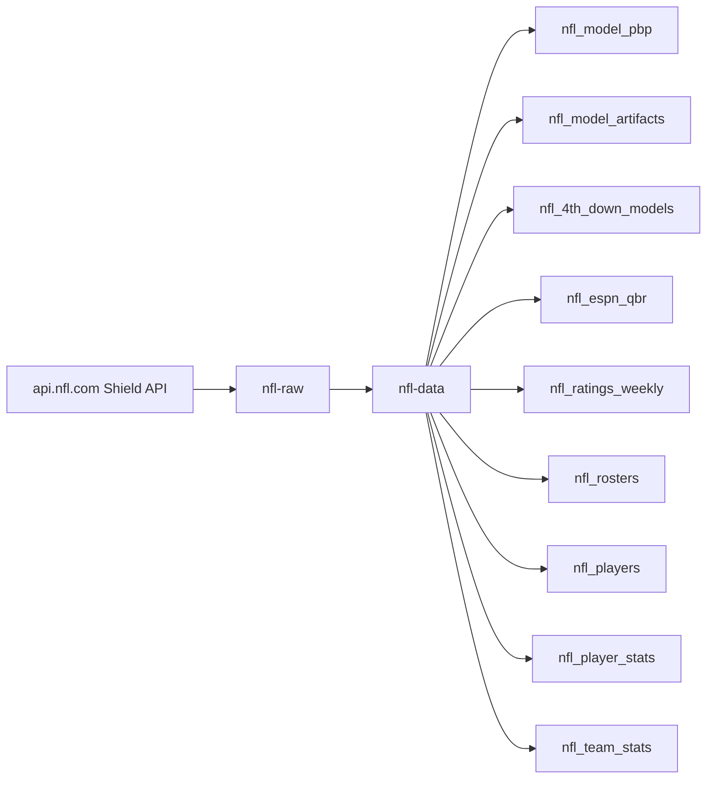
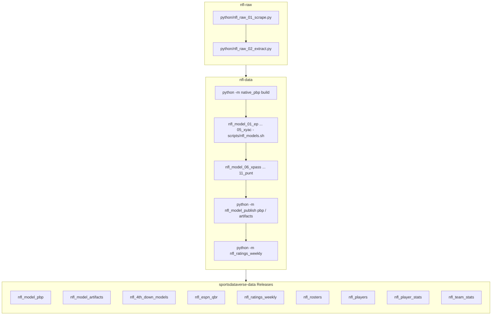

# nfl-data

Builds NFL **compiled play-by-play datasets** and trains **EP / WP / CP models** from the raw NFL
game JSON committed in [`sportsdataverse/nfl-raw`](https://github.com/sportsdataverse/nfl-raw),
then publishes datasets + model artifacts to GitHub Releases on
[`sportsdataverse/sportsdataverse-data`](https://github.com/sportsdataverse/sportsdataverse-data).

Sibling of `nfl-raw` in the SportsDataverse `-raw` → `-data` split: `nfl-raw` scrapes and commits
raw JSON; `nfl-data` is the consumer that reshapes (with nflfastR parity), models, reports, and
publishes. See `docs/raw-to-data-migration-playbook.md` and
`docs/superpowers/specs/2026-06-17-nfl-raw-to-data-migration-design.md`.

## NFL workflow diagram





Drivers are the four cron workflows (`nfl_pbp_cron.yml`, `nfl_model_pipeline.yml`,
`nfl_ratings_weekly.yml`, `nfl_rosters_players_cron.yml`); each invokes the module
CLIs above. Raw per-game JSON is fetched from
[`nfl-raw`](https://github.com/sportsdataverse/nfl-raw) over HTTP — never a clone.

[nfl-raw repository (source: api.nfl.com Shield API)](https://github.com/sportsdataverse/nfl-raw)

[sportsdataverse-py (Shield wrappers, `.nfl` submodule)](https://github.com/sportsdataverse/sportsdataverse-py)

## Layout

- `python/` — uv project. `native_pbp/` (compiled-PBP builder, nflfastR parity), `nfl_data_ingest/`
  (URL-ingest of nfl-raw JSON), `model_training/play_level/` (EP/WP/CP trainer + reports),
  `nfl_model_publish/` (artifact uploader). *(Populated across SP1–SP2.)*
- `R/` — dataset-parity publish toolchain (`write_dataset`/`publish_dataset` → parquet/rds/csv.gz via
  piggyback). *(Added in SP2.)*
- `docs/` — migration playbook, design spec, implementation plans, generated model reports.

## Develop

```sh
cd python
uv sync
uv run pytest          # hermetic suite (integration tests deselected by default)
```

## Reports & explainers

<!-- BEGIN GENERATED: reports -->

| Report | What it is | Last updated |
|---|---|---|
| [Model registry](models/REGISTRY.md) | model | artifact | gates | retrain, one row per published model | 2026-09-01 |
| [Model reports & cards](docs/models/) | 14 files, one per item | 2026-09-01 |
| [`-raw` → `-data` Migration Playbook (CFB reference → NFL target)](docs/raw-to-data-migration-playbook.md) | explainer | 2026-06-24 |

<!-- END GENERATED: reports -->

## Automation & status

<!-- BEGIN GENERATED: status -->

| workflow | schedule | last run |
|---|---|---|
| [](https://github.com/sportsdataverse/nfl-data/actions/workflows/nfl_model_pipeline.yml) | day 1 06:00 UTC in Mar | never run |
| [](https://github.com/sportsdataverse/nfl-data/actions/workflows/nfl_pbp_cron.yml) | Mondays 09:00 UTC in Jan, Feb, Sep, Oct, Nov, Dec | 2026-06-30 |
| [](https://github.com/sportsdataverse/nfl-data/actions/workflows/nfl_ratings_weekly.yml) | Tuesdays 10:00 UTC in Jan, Feb, Sep, Oct, Nov, Dec | never run |
| [](https://github.com/sportsdataverse/nfl-data/actions/workflows/nfl_rosters_players_cron.yml) | Mondays 09:00 UTC in Jan, Feb, Sep, Oct, Nov, Dec | never run |
| [](https://github.com/sportsdataverse/nfl-data/actions/workflows/orphan_scripts.yml) | on push / PR / dispatch | 2026-08-28 |
| [](https://github.com/sportsdataverse/nfl-data/actions/workflows/tests.yml) | on push / PR / dispatch | 2026-08-28 |

| release tag | assets | size | last publish |
|---|---:|---:|---|
| [`nfl_4th_down_models`](https://github.com/sportsdataverse/sportsdataverse-data/releases/tag/nfl_4th_down_models) | 2 | 66.9 MB | 2026-06-24 |
| [`nfl_espn_qbr`](https://github.com/sportsdataverse/sportsdataverse-data/releases/tag/nfl_espn_qbr) | 2 | 0.4 MB | 2026-06-23 |
| [`nfl_model_artifacts`](https://github.com/sportsdataverse/sportsdataverse-data/releases/tag/nfl_model_artifacts) | 11 | 50.8 MB | 2026-06-24 |
| [`nfl_model_pbp`](https://github.com/sportsdataverse/sportsdataverse-data/releases/tag/nfl_model_pbp) | 27 | 168.7 MB | 2026-06-30 |
| [`nfl_player_stats`](https://github.com/sportsdataverse/sportsdataverse-data/releases/tag/nfl_player_stats) | 1 | 4.2 MB | 2026-06-23 |
| [`nfl_players`](https://github.com/sportsdataverse/sportsdataverse-data/releases/tag/nfl_players) | 1 | 0.4 MB | 2026-06-18 |
| [`nfl_ratings_weekly`](https://github.com/sportsdataverse/sportsdataverse-data/releases/tag/nfl_ratings_weekly) | 27 | 0.8 MB | 2026-08-07 |
| [`nfl_rosters`](https://github.com/sportsdataverse/sportsdataverse-data/releases/tag/nfl_rosters) | 24 | 5.1 MB | 2026-07-12 |
| [`nfl_team_stats`](https://github.com/sportsdataverse/sportsdataverse-data/releases/tag/nfl_team_stats) | 1 | 0.9 MB | 2026-06-23 |

<!-- END GENERATED: status -->

## Consumers

The packages that read what this repo produces:

- **Python:** [`sportsdataverse.nfl (load_nfl_*)`](https://github.com/sportsdataverse/sportsdataverse-py) — docs at <https://py.sportsdataverse.org>
- nflreadpy-parity surface; see also the [nflverse](https://nflverse.nflverse.com) ecosystem

## Stage inventory

Every numbered pipeline stage in `python/` (auto-listed; run subsets with the `scripts/*.sh` drivers by number or name):

- `python/nfl_data_01_ingest.py`
- `python/nfl_data_02_model_pbp.py`
- `python/nfl_data_03_pbp_publish.py`
- `python/nfl_data_04_rosters_players.py`
- `python/nfl_data_05_ratings_weekly.py`
- `python/nfl_model_01_ep.py`
- `python/nfl_model_02_wp_spread.py`
- `python/nfl_model_03_wp_naive.py`
- `python/nfl_model_04_cp.py`
- `python/nfl_model_05_xyac.py`
- `python/nfl_model_06_xpass.py`
- `python/nfl_model_07_fd.py`
- `python/nfl_model_08_two_pt.py`
- `python/nfl_model_09_fg.py`
- `python/nfl_model_10_wp.py`
- `python/nfl_model_11_punt.py`

Model release tags published from here: `nfl_4th_down_models`, `nfl_model_artifacts`, `nfl_model_pbp`
