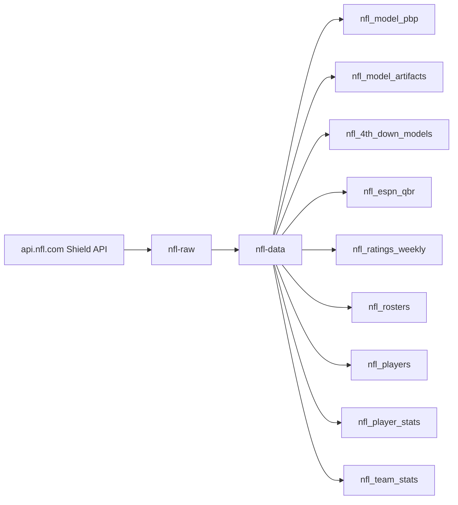
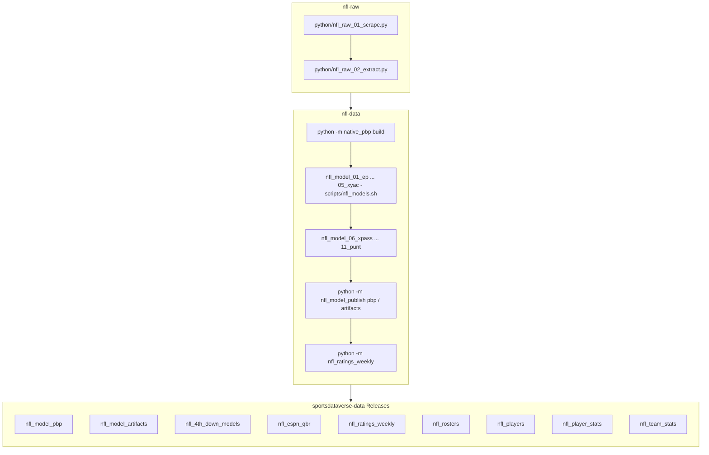

# nfl-data

Builds NFL **compiled play-by-play datasets** and trains **EP / WP / CP models** from the raw NFL
game JSON committed in [`sportsdataverse/nfl-raw`](https://github.com/sportsdataverse/nfl-raw),
then publishes datasets + model artifacts to GitHub Releases on
[`sportsdataverse/sportsdataverse-data`](https://github.com/sportsdataverse/sportsdataverse-data).

Sibling of `nfl-raw` in the SportsDataverse `-raw` → `-data` split: `nfl-raw` scrapes and commits
raw JSON; `nfl-data` is the consumer that reshapes (with nflfastR parity), models, reports, and
publishes. See `docs/raw-to-data-migration-playbook.md` and
`docs/superpowers/specs/2026-06-17-nfl-raw-to-data-migration-design.md`.

## NFL workflow diagram


```mermaid
  graph LR;
    S[api.nfl.com Shield API]-->A[nfl-raw];
    A[nfl-raw]-->B[nfl-data];
    B[nfl-data]-->C1[nfl_model_pbp];
    B[nfl-data]-->C2[nfl_model_artifacts];
    B[nfl-data]-->C3[nfl_4th_down_models];
    B[nfl-data]-->C4[nfl_espn_qbr];
    B[nfl-data]-->C5[nfl_ratings_weekly];
    B[nfl-data]-->C6[nfl_rosters];
    B[nfl-data]-->C7[nfl_players];
    B[nfl-data]-->C8[nfl_player_stats];
    B[nfl-data]-->C9[nfl_team_stats];
```


```mermaid
flowchart TB;
    subgraph A[nfl-raw];
        direction TB;
        A0[python/nfl_raw_01_scrape.py]-->A1[python/nfl_raw_02_extract.py];
    end;

    subgraph B[nfl-data];
        direction TB;
        B0[python -m native_pbp build]-->B1[nfl_model_01_ep ... 05_xyac - scripts/nfl_models.sh];
        B1[nfl_model_01_ep ... 05_xyac - scripts/nfl_models.sh]-->B2[nfl_model_06_xpass ... 11_punt];
        B2[nfl_model_06_xpass ... 11_punt]-->B3[python -m nfl_model_publish pbp / artifacts];
        B3[python -m nfl_model_publish pbp / artifacts]-->B4[python -m nfl_ratings_weekly];
    end;

    subgraph C[sportsdataverse-data Releases];
        direction TB;
        C1[nfl_model_pbp];
        C2[nfl_model_artifacts];
        C3[nfl_4th_down_models];
        C4[nfl_espn_qbr];
        C5[nfl_ratings_weekly];
        C6[nfl_rosters];
        C7[nfl_players];
        C8[nfl_player_stats];
        C9[nfl_team_stats];
    end;

    A-->B;
    B-->C;
```

Drivers are the four cron workflows (`nfl_pbp_cron.yml`, `nfl_model_pipeline.yml`,
`nfl_ratings_weekly.yml`, `nfl_rosters_players_cron.yml`); each invokes the numbered
stages above (run subsets locally via `scripts/nfl_data.sh` / `scripts/nfl_models.sh`
by number or name). Raw per-game JSON is fetched from
[`nfl-raw`](https://github.com/sportsdataverse/nfl-raw) over HTTP — never a clone.

[nfl-raw repository (source: api.nfl.com Shield API)](https://github.com/sportsdataverse/nfl-raw)

[sportsdataverse-py (Shield wrappers, `.nfl` submodule)](https://github.com/sportsdataverse/sportsdataverse-py)

## Repository layout

<!-- BEGIN GENERATED: layout -->

```
nfl-data/
├── R/   # R pipeline stages and publish toolchain
│   ├── _data_utils.R
│   └── nfl_publish_model_pbp.R
├── dev/   # working notes, not part of the pipeline
├── docs/   # explainers, model reports and dataset docs
│   ├── models/
│   └── superpowers/
├── features/   # feature-set definitions
├── models/   # model artifacts, cards and the registry
├── models_fullhist/
├── out/
│   ├── nfl_ratings_weekly/
│   └── nfl_ratings_weekly_early/
├── python/   # Python pipeline stages, numbered in build order
│   ├── data/
│   ├── model_training/
│   ├── models/
│   ├── native_pbp/
│   ├── nfl_data_ingest/
│   ├── nfl_model_publish/
│   ├── nfl_ratings_weekly/
│   ├── nfl_team_summaries/
│   ├── out/
│   ├── conftest.py
│   ├── nfl_data_01_ingest.py
│   ├── nfl_data_02_model_pbp.py
│   ├── nfl_data_03_pbp_publish.py
│   ├── nfl_data_04_rosters_players.py
│   ├── nfl_data_05_ratings_weekly.py
│   ├── nfl_data_06_team_summaries.py
│   ├── nfl_data_07_metric_curves.py
│   ├── nfl_data_08_defense_vs_position.py
│   ├── nfl_model_01_ep.py
│   ├── nfl_model_02_wp_spread.py
│   └── … 9 more
├── scripts/   # bash drivers (the daily/weekly entry points)
│   ├── nfl_data.sh
│   └── nfl_models.sh
├── tests/   # test suite
│   ├── native_pbp/
│   ├── nfl_data_ingest/
│   ├── nfl_model_publish/
│   ├── __init__.py
│   ├── test_constants.py
│   ├── test_decision_models_parity.py
│   ├── test_decision_models_trainer_smoke.py
│   ├── test_feature_sets.py
│   ├── test_features.py
│   ├── test_fetcher.py
│   ├── test_figures_report.py
│   ├── test_fingerprint.py
│   ├── test_id_conventions.py
│   ├── test_ingest.py
│   ├── test_labels.py
│   ├── test_metrics.py
│   └── … 7 more
└── tools/   # repo-local helper scripts
    ├── hooks/
    └── nfl4th_models/
```

<!-- END GENERATED: layout -->

- `python/` — uv project. `native_pbp/` (compiled-PBP builder, nflfastR parity), `nfl_data_ingest/`
  (URL-ingest of nfl-raw JSON), `model_training/play_level/` (EP/WP/CP trainer + reports),
  `nfl_model_publish/` (artifact uploader). *(Populated across SP1–SP2.)*
- `R/` — dataset-parity publish toolchain (`write_dataset`/`publish_dataset` → parquet/rds/csv.gz via
  piggyback). *(Added in SP2.)*
- `docs/` — migration playbook, design spec, implementation plans, generated model reports.

## Develop

```sh
cd python
uv sync
uv run pytest          # hermetic suite (integration tests deselected by default)
```

## Reports & explainers

<!-- BEGIN GENERATED: reports -->

| Report | What it is | Last updated |
|---|---|---|
| [Model registry](models/REGISTRY.md) | model | artifact | gates | retrain, one row per published model | 2026-09-01 |
| [Model reports & cards](docs/models/) | 14 files, one per item | 2026-09-01 |
| [`-raw` → `-data` Migration Playbook (CFB reference → NFL target)](docs/raw-to-data-migration-playbook.md) | explainer | 2026-06-24 |

<!-- END GENERATED: reports -->

## Automation & status

<!-- BEGIN GENERATED: status -->

| workflow | schedule | last run |
|---|---|---|
| [](https://github.com/sportsdataverse/nfl-data/actions/workflows/nfl_model_pipeline.yml) | day 1 06:00 UTC in Mar | never run |
| [](https://github.com/sportsdataverse/nfl-data/actions/workflows/nfl_pbp_cron.yml) | Mondays 09:00 UTC in Jan, Feb, Sep, Oct, Nov, Dec | 2026-06-30 |
| [](https://github.com/sportsdataverse/nfl-data/actions/workflows/nfl_ratings_weekly.yml) | Tuesdays 14:00 UTC in Jan, Feb, Sep, Oct, Nov, Dec | never run |
| [](https://github.com/sportsdataverse/nfl-data/actions/workflows/nfl_rosters_players_cron.yml) | Mondays 09:00 UTC in Jan, Feb, Sep, Oct, Nov, Dec | never run |
| [](https://github.com/sportsdataverse/nfl-data/actions/workflows/orphan_scripts.yml) | on push / PR / dispatch | 2026-08-28 |
| [](https://github.com/sportsdataverse/nfl-data/actions/workflows/tests.yml) | on push / PR / dispatch | 2026-08-28 |

| release tag | assets | size | last publish |
|---|---:|---:|---|
| [`nfl_4th_down_models`](https://github.com/sportsdataverse/sportsdataverse-data/releases/tag/nfl_4th_down_models) | 2 | 66.9 MB | 2026-06-24 |
| [`nfl_espn_qbr`](https://github.com/sportsdataverse/sportsdataverse-data/releases/tag/nfl_espn_qbr) | 2 | 0.4 MB | 2026-06-23 |
| [`nfl_model_artifacts`](https://github.com/sportsdataverse/sportsdataverse-data/releases/tag/nfl_model_artifacts) | 11 | 50.8 MB | 2026-06-24 |
| [`nfl_model_pbp`](https://github.com/sportsdataverse/sportsdataverse-data/releases/tag/nfl_model_pbp) | 27 | 168.7 MB | 2026-06-30 |
| [`nfl_player_stats`](https://github.com/sportsdataverse/sportsdataverse-data/releases/tag/nfl_player_stats) | 1 | 4.2 MB | 2026-06-23 |
| [`nfl_players`](https://github.com/sportsdataverse/sportsdataverse-data/releases/tag/nfl_players) | 1 | 0.4 MB | 2026-06-18 |
| [`nfl_ratings_weekly`](https://github.com/sportsdataverse/sportsdataverse-data/releases/tag/nfl_ratings_weekly) | 27 | 0.8 MB | 2026-08-07 |
| [`nfl_rosters`](https://github.com/sportsdataverse/sportsdataverse-data/releases/tag/nfl_rosters) | 24 | 5.1 MB | 2026-07-12 |
| [`nfl_team_stats`](https://github.com/sportsdataverse/sportsdataverse-data/releases/tag/nfl_team_stats) | 1 | 0.9 MB | 2026-06-23 |

<!-- END GENERATED: status -->

## Player percentiles

Every ranked metric on `nfl_passing` / `nfl_rushing` / `nfl_receiving` ships a
`{metric}_pct` column next to its `{metric}_rank`, and `nfl_player_percentiles`
carries the thresholds behind them. Five things a reader will otherwise get wrong:

1. **Percentile is among QUALIFIERS, not among all players.** The gate is
   Pro-Football-Reference's per-category minimum — **14 dropbacks**, **6.25
   carries** or **1.875 targets per team-game** — the same one gameonpaper.com's
   leaderboards advertise and the same one `_rank` uses. A receiver at the 50th
   percentile sits well above the median receiver; a UI that calls it "median"
   is lying.
2. **The position group is the table.** Percentiles are computed within
   (season, table), so a QB is placed against QBs.
3. **Weibull position `100 · (n + 1 − rank) / (n + 1)`** — nobody is pinned to
   exactly 0 or 100, which leaves room at both ends.
4. **A null metric yields a null percentile**, and null rows leave the
   denominator, so "unknown" never renders as "worst" or depresses everyone
   else's placing. Its `_rank` is null too, as is every rank of a constant
   column (all values equal, e.g. `passrate_off_pass`).
5. **In-season percentiles move weekly** as the qualifier population grows.
   Expected, not a bug.

`nfl_player_percentiles` (release tag of the same name, one file per season) is
the player twin of `nfl_percentiles`: 297 rows × 29 columns — `position_group`
(`passing` / `rushing` / `receiving`) × `pctile` (0.01 … 0.99), one Float64
column per ranked metric (the union of the three tables' metrics; a metric a
group does not rank is null there), plus `season`. Direction is handled in the
table: for a **low-is-good** metric (`pass_int`, `sacked`, `fumbles`,
`stuff_rate`) the row at `pctile = 0.90` holds the value a player with
`{metric}_pct = 90` actually has — a LOW count — so a bar drawn from these
thresholds agrees with the player's own `_pct` instead of contradicting it.

## Player dispersion and rushing tiers

`nfl_passing` / `nfl_rushing` / `nfl_receiving` carry the spread of a player's
per-game EPA/play, and `nfl_rushing` the yardage tiers of his carries. The
definitions, thresholds, names and null rules are the college twin's
(`espn_cfb_passing` / `espn_cfb_rushing` / `espn_cfb_receiving`), so the two
leagues read alike.

A game's EPA/play is its EPA sum over the plays the table credits the player
with, divided by those plays: a passer's dropbacks (throws and sacks, the plays
`TEPA` and `dropbacks` sum), a rusher's carries, a receiver's targets.

| col_name | col_type | col_description |
| --- | --- | --- |
| dispersion_games | Int64 | Games with at least one such play: the n behind the five columns below (equal to `games` in this league). |
| EPAplay_sd | Float64 | Population sd of the per-game EPA/play. Null under 3 games. |
| EPAplay_p10, EPAplay_p90 | Float64 | Floor and ceiling: 10th / 90th percentile of the per-game EPA/play (linear interpolation, R type 7). Null under 3 games. |
| boom_rate, bust_rate | Float64 | Share of the player's games more than one sd above / below his own per-game mean (the unweighted mean of those games, not the play-weighted `EPAplay`). Strict, so a player whose games are all equal is neither. Null under 3 games. |

`nfl_rushing` only:

| col_name | col_type | col_description |
| --- | --- | --- |
| line_yards_share, second_level_share, open_field_share | Float64 | Share of carries that gained 4 or fewer yards (losses included), 5-10, and 11 or more: Football Outsiders' line / second-level / open-field cut-points. The three sum to 1. |
| stuff_rate | Float64 | Share of carries for 0 or fewer yards. |
| EPAplay_one_score, EPAplay_not_one_score | Float64 | EPA per carry with the score within 8 points at the snap, and otherwise. Null with no such carries. |
| EPAplay_one_score_n, EPAplay_not_one_score_n | Int64 | Carries behind each side of the split. |

Only `boom_rate` (every table) and `stuff_rate` (low is good) are leaderboard
metrics: each has its `_rank`, `_pct` and `_pos_pct` and a threshold column in
`nfl_player_percentiles`. The other columns are descriptive and carry none.
`dispersion_games` is a count, so `nfl_league_averages` has no row for it.

Where this league's play-by-play names differ from the college frame's: a
carry's yards are `rushing_yards` (the `yards` the table already sums), and the
margin at the snap is nflfastR's `score_differential`, the offense's score minus
the defense's before the play.

## Team opponent splits

`nfl_team_opponent_splits` is one row per team per regular-season game, so every
game has two rows. It feeds the vs-opponent bars on team-season pages, and its
columns match the college twin's `cfb_team_opponent_splits`. `epa_per_play`,
`success_rate` and `plays` come from the same scrimmage frame as
`team_summaries.EPAplay_off`: weight a team's rows by `plays` and you get its
season `EPAplay_off` back. The points are the game's final score. A game with
no scrimmage snap has no rows: the 2022 BUF-CIN no-contest carries a 7-3
"score" but was never played. From 2002 on, a played game with no ESPN event
id in nfl-raw's crosswalk fails this table's build. The seven other tags
still build and publish, and the run exits 1.

| col_name | col_type | col_description |
| --- | --- | --- |
| season | Int64 | Season year (e.g. 2025). |
| team_id | Int64 | ESPN team id (vendored crosswalk). |
| opponent_id | Int64 | ESPN team id of the opponent. |
| game_id | Int64 | ESPN event id, from nfl-raw's `crosswalk/games.json`. Null before 2002, where ESPN has no library. |
| epa_per_play | Float64 | Mean EPA over the team's scrimmage plays in the game. |
| success_rate | Float64 | Share of those plays with EPA > 0. |
| points_for | Int64 | Team's final score. |
| points_against | Int64 | Opponent's final score. |
| plays | Int64 | Scrimmage plays behind `epa_per_play`. |
| is_home | Boolean | Team is the designated home team (true at a neutral site too). |
| week | Int64 | Week of the season. |
| season_type | Int64 | ESPN season-type code (2 = regular season). |
| nflverse_game_id | Utf8 | nflverse game id (e.g. `2025_01_KC_LAC`). |

## League averages

`nfl_league_averages` is the mean / median / sd / n baseline behind every
`_rank` / `_pct` column and the `percentiles` ladder — the college twin's
`cfb_league_averages`, ported straight over (`python/nfl_team_summaries/league_averages.py`
mirrors `cfbfastR-cfb-data`'s module of the same name; only the levels differ, since this
league has one tier where the college grid splits fbs/p4/g5). The grain is one row per
`(season, level, entity, category, metric)`, with `level` always `nfl` (no p4/g5-style
split in a single-tier league):

| col_name | col_type | col_description |
| --- | --- | --- |
| season | Int64 | Season year (e.g. 2025). |
| level | Utf8 | Always `nfl` in this league. |
| entity | Utf8 | Population the row is drawn from: `team` (`team_summaries`, `team_game`) or `player` (`passing`, `rushing`, `receiving`). |
| category | Utf8 | Source table the metric comes from: `team_summaries`, `passing`, `rushing`, `receiving`, or `team_game` (the per-game frame behind `percentiles`). |
| metric | Utf8 | Name of the summarized column (e.g. `EPAplay`, `TEPA`). Ids, ranks, percentiles and sample-size (`_n`) columns are never metrics. |
| mean | Float64 | **Unweighted mean of `metric` across qualifying, finite entity rows — not a pooled per-play rate.** Averaging 32 teams' EPA/play is not the same number as EPA/play over every play league-wide, and this column is always the former. |
| median | Float64 | Median of `metric` across the same rows. |
| sd | Float64 | Sample standard deviation (`ddof=1`); null when `n == 1` (no spread from a single value). |
| n | Int64 | Count of finite, qualifying rows the statistics are computed over — **the same denominator as the matching `{metric}_pct` column**, since a baseline is never taken over a different population than the percentile beside it. A null or non-finite metric value is skipped and does not count toward `n`. |
| qualifier_min | Float64 | The per-team-game leaderboard gate applied before summarizing a player category (14.0 dropbacks for `passing`, 6.25 carries for `rushing`, 1.875 targets for `receiving`); **null on the team categories** (`team_summaries`, `team_game`), which have no qualifier. |

## Defense vs position

`nfl_defense_vs_position` is one row per `(season, team_id, position_group)` for the
DEFENSE: what it allowed to quarterbacks, running backs (RB + FB), wide receivers and
tight ends. It is the NFL twin of the college `cfb_defense_vs_position`. Stage 08 passes
sdv-py's `defense_vs_position(pbp, rosters, "nfl")` through unchanged over one season of
`nfl_model_pbp`, regular season and postseason (stage 07's population; stage 06's
tables are regular season only). Position groups come from the nflverse season roster
(`load_nfl_rosters`, the roster stage 06 reads), matched on the gsis id.

Every dropback (pass attempt, sack or scramble) is a QB play. A carry goes to the
rusher's roster group and a target to the receiver's, so a completion to a tight end
counts once for QB and once for TE. A carrier or receiver with no roster row, another
position, or two different groups in the season counts in no group.

The table starts in 1999, the first `nfl_model_pbp` season (31 teams until 2002). The
roster is not what sets that floor: in every season 1999–2025 at least 99.8% of carries
and of named targets join a roster position. An earlier season is not built and no
empty file is written.

**Percentiles.** Each rate has a `_pct`: its percentile among the defenses with 3+
games in that position group (`qualified`), within the season, over the whole league.
It is the F5 cohort helper's Weibull position, `100 * (n + 1 - rank) / (n + 1)`, and
it always reads the same way: **higher is the better defense**.

| metric | better defense | a high `_pct` means |
| --- | --- | --- |
| `epa_per_play_allowed` | lower | allowed less EPA per play |
| `success_rate_allowed` | lower | allowed fewer successes |
| `explosive_rate_allowed` | lower | allowed fewer explosives |
| `rush_yards_per_carry_allowed` (RB) | lower | allowed fewer yards per carry |
| `yards_per_target_allowed` (WR, TE) | lower | allowed fewer yards per target |
| `sack_rate_allowed` (QB) | **higher** | sacked the quarterback more often |

A non-qualifier, a null metric and a position group with fewer than 5 qualifiers get a
null `_pct`, so in the current season every `_pct` is null until five defenses have
played three games.

**Targets that name no receiver.** A throw with no receiver id reaches the QB row and no
WR or TE row, so the WR and TE rates are on targets naming a receiver.
`unattributed_target_share` says how many throws that leaves out, per defense-season.
Measured on the released seasons (2026-10-04):

| seasons | league share | what is missing |
| --- | --- | --- |
| 2009–2025 | 1–4% (2024: 4.1%, defenses 2.4–6.1%; 2025: 4.4%, defenses 2.8–6.3%) | throwaways, a handful of interceptions |
| 1999–2001 | 2–4% | some incompletions and interceptions |
| 2002 | 9% | the same, more of them |
| 2003–2008 | 38–41% (defenses 29–50%) | **every** incompletion and interception |

In 2003–2008 the play-by-play carries no receiver id on an incomplete or intercepted
pass, so a WR or TE row of those six seasons is completions only: its success rate and
yards per target read high. Compare those rows within their own season, where every
defense is measured the same way. Nothing is imputed.

| col_name | col_type | col_description |
| --- | --- | --- |
| season | Int64 | Season year (e.g. 2025). |
| team_id | Int64 | ESPN team id of the defense (vendored crosswalk), the key stage 06's tables carry. |
| pos_team | Utf8 | nflverse abbreviation of the defense (current franchise, e.g. `LV` in 1999). |
| team_name | Utf8 | Team name. |
| division | Utf8 | Division (e.g. `AFC West`). |
| conference | Utf8 | `AFC` or `NFC`. |
| position_group | Utf8 | `QB`, `RB` (RB + FB), `WR` or `TE`: the offensive group the row is about. |
| plays | Int64 | Scrimmage plays on a numbered down counted for the group. |
| games | Int64 | Games with at least one of those plays. |
| epa_per_play_allowed | Float64 | Mean EPA of those plays. |
| success_rate_allowed | Float64 | Share of those plays with EPA > 0. |
| explosive_rate_allowed | Float64 | Share that are explosive: a dropback with EPA >= 2.4 or a carry with EPA >= 1.8. |
| dropbacks | Int64 | Dropbacks faced (pass attempts, sacks, scrambles). QB rows only. |
| sack_rate_allowed | Float64 | Sacks per dropback: the rate at which the defense got sacks. QB rows only. |
| carries | Int64 | Carries by the group. RB rows only. |
| rush_yards_per_carry_allowed | Float64 | Rushing yards per carry. RB rows only. |
| targets | Int64 | Targets naming a receiver of the group. WR and TE rows only. |
| yards_per_target_allowed | Float64 | Receiving yards per target naming a receiver (0 on an incompletion or interception). WR and TE rows only. |
| qualified | Boolean | `games >= 3`. Only qualifiers get a `_pct`. |
| unattributed_target_share | Float64 | Share of the passes thrown against the defense (dropbacks that are neither sacks nor scrambles) that name no receiver. Per defense-season, repeated on its WR and TE rows; null on QB and RB. |
| epa_per_play_allowed_pct | Float64 | Percentile of `epa_per_play_allowed` among qualifiers of the position group; higher = allowed less. |
| success_rate_allowed_pct | Float64 | Percentile of `success_rate_allowed`; higher = allowed fewer successes. |
| explosive_rate_allowed_pct | Float64 | Percentile of `explosive_rate_allowed`; higher = allowed fewer explosives. |
| sack_rate_allowed_pct | Float64 | Percentile of `sack_rate_allowed`; higher = sacked the quarterback MORE often (the one reversed column). QB rows only. |
| rush_yards_per_carry_allowed_pct | Float64 | Percentile of `rush_yards_per_carry_allowed`; higher = allowed fewer yards per carry. RB rows only. |
| yards_per_target_allowed_pct | Float64 | Percentile of `yards_per_target_allowed`, on targets naming a receiver; higher = allowed fewer yards per target. WR and TE rows only. |

## Paper Index: deserved wins and luck

`nfl_paper_index_games` is one row per team per scored game: `paper_share`, the team's
deserved-win probability under Game on Paper's Paper Index, built from eight performance
margins (success rate, explosive-play rate, explosiveness, scoring-opportunity
conversion, points per opportunity, starting field position, havoc, turnovers). The two
shares of a game sum to 1. It is the NFL twin of the college `cfb_paper_index_games`.
Stage 09 passes sdv-py's `paper_index_games(pbp, "nfl")` through unchanged and adds
`paper_index_span`. Nothing is fitted in this repo: the weights are
`sportsdataverse.paper_index`'s.

**Input.** The Paper Index reads ESPN-shape columns that `nfl_model_pbp` does not carry,
so unlike stages 06–08 this stage reads `espn_nfl_pbp` (2002–). It runs from
`scripts/espn_nfl_data.sh` after the ESPN family build, on the pbp that run just wrote.

**Which games.** A game is scored when it is completed, has a winner and both sides ran
20 or more scrimmage snaps; the Pro Bowl is out. **A tie has no row**: it is not a game,
a win or a loss anywhere downstream, and never half a win. Preseason (`season_type` 1,
in ESPN's library from 2026), regular season (2) and postseason (3) are all in the
per-game table, so filter `season_type` before summing; ESPN numbers postseason weeks
from 1 again. Where ESPN's library is thin the table is too: 2005 holds 17 games (the
rest of that season's plays carry no text), and the truncated 2002–2004 and 2007 feeds
are not scored.

**In-sample label.** `paper_index_span` says where the season sits against the fit. The
seasons are read from sdv-py's `TRAIN_SEASONS` / `HOLDOUT_SEASONS` at build time (at the
locked sdv-py: train 2016–2021, holdout 2022–2025):

| `paper_index_span` | meaning |
| --- | --- |
| `train` | That season's games were part of the fit: its shares, deserved wins and luck are **in-sample**. |
| `holdout` | Scored out of sample at fit time, though not fully clean: the EP model behind the EPA, success and explosiveness inputs and the field-position curve were trained on spans that include these seasons. |
| `out_of_span` | Never seen by the fit and never evaluated (before 2016, after 2025). |

| col_name | col_type | col_description |
| --- | --- | --- |
| game_id | Int64 | ESPN event id. |
| team_id | Int64 | ESPN team id (the key stage 06's tables carry). |
| season | Int64 | Season year. |
| season_type | Int64 | ESPN season-type code: 1 preseason, 2 regular season, 3 postseason. |
| week | Int64 | Week within the season type (postseason restarts at 1). |
| won | Boolean | The team outscored its opponent. |
| paper_share | Float64 | The team's deserved-win probability, 0–1. |
| opp_share | Float64 | The opponent's (`1 - paper_share`). |
| success_margin | Float64 | Success rate, team minus opponent. Every margin is signed so that positive favors the team. |
| explosive_margin | Float64 | Explosive-play rate, team minus opponent. |
| explosive_epa_margin | Float64 | EPA per successful play, team minus opponent. |
| opp_conversion_margin | Float64 | Share of scoring-opportunity drives that scored, team minus opponent. |
| pts_per_opp_margin | Float64 | Points per scoring opportunity (made field goals counted), team minus opponent. |
| field_position_margin | Float64 | Expected points of the average drive start, team minus opponent. |
| havoc_margin | Float64 | Havoc rate the team's defense created minus the rate it allowed. |
| turnovers_margin | Float64 | Opponent's turnovers minus the team's. |
| paper_index_span | Utf8 | `train` (that season's games were part of the fit), `holdout` or `out_of_span`: see above. |

**Season columns on `nfl_team_summaries`.** Stage 06 sums the same shares with sdv-py's
`deserved_wins()` and appends seven columns. They cover exactly the games the table's
play metrics cover: the shares are cut by the game ids of the plays stage 06 aggregates
(`espn_nfl_pbp` carries each game's `nflverse_game_id`), so by default the regular
season only. A playoff game's share is in `nfl_paper_index_games` and in no
regular-season column. This repo has no weekly summaries table; a to-date season file is
the running snapshot, and an as-of-week sum can be taken from the per-game table.

| col_name | col_type | col_description |
| --- | --- | --- |
| deserved_wins | Float64 | Sum of the team's `paper_share` over its scored games. |
| luck_wins | Float64 | Wins minus `deserved_wins`, over the same games. Positive = won more than deserved. |
| luck_z | Float64 | `luck_wins` in standard deviations: divided by `sqrt(sum(p * (1 - p)))` over the team's shares. |
| luck_wins_rank | Float64 | Rank of `luck_wins` among the season's teams that have one, 1 = luckiest. Null when the team has no scored game. |
| luck_z_rank | Float64 | Rank of `luck_z`, same population and direction. |
| paper_index_games_n | Int64 | Games that entered the sums. Ties, games the Paper Index cannot score and games `espn_nfl_pbp` does not hold yet are not counted, so it can be below the team's games played. 0 with null luck before 2002. |
| paper_index_span | Utf8 | `train` (that season's games were part of the fit: in-sample), `holdout` or `out_of_span`, as above. |

Read them with care. `luck_wins + deserved_wins` is the team's wins over
`paper_index_games_n` games, not its official record. Luck includes home field (the
share has no intercept; sdv-py's `deserved_wins` docstring has the measured size).
`espn_nfl_pbp` is published by a different workflow than `nfl_model_pbp`: when it is a
week behind, the luck columns sum the games it holds and `paper_index_games_n` shows it.

**Not model features.** All seven columns are derived from game outcomes. They are
attached after the conference percentiles and `nfl_league_averages` are built, and
`league_averages` excludes them by name; no trainer or feature set in this repo reads
the summaries tables.

## Consumers

The packages that read what this repo produces:

- **Python:** [`sportsdataverse.nfl (load_nfl_*)`](https://github.com/sportsdataverse/sportsdataverse-py) — docs at <https://py.sportsdataverse.org>
- nflreadpy-parity surface; see also the [nflverse](https://nflverse.nflverse.com) ecosystem

## Stage inventory

Every numbered pipeline stage in `python/` (auto-listed; run subsets with the `scripts/*.sh` drivers by number or name):

- `python/nfl_data_01_ingest.py`
- `python/nfl_data_02_model_pbp.py`
- `python/nfl_data_03_pbp_publish.py`
- `python/nfl_data_04_rosters_players.py`
- `python/nfl_data_05_ratings_weekly.py`
- `python/nfl_data_06_team_summaries.py` — season team grid + passing/rushing/receiving leaderboards + percentiles + league baselines (`nfl_team_summaries`, `nfl_passing`, `nfl_rushing`, `nfl_receiving`, `nfl_percentiles`, `nfl_player_percentiles`, `nfl_league_averages`, `nfl_team_opponent_splits`); the NFL twin of the college `team_summaries` family that gameonpaper.com's NFL pages read
- `python/nfl_data_07_metric_curves.py` — league / team / player rate curves along a continuous axis (`nfl_metric_curves`: FG% by kick distance, completion% and EPA by air-yards bucket, 4th-down conversion by yards to go, success by down × distance; sdv-py `metric_curves` over `nfl_model_pbp`, REG + POST). Team ids are the ESPN team id as in stage 06; player `entity_id` is the ESPN athlete id re-keyed from nflfastR through sdv-py's players master with `gsis_id` kept alongside (no match → `entity_id = gsis_id`, `id_source = "gsis"`). Unlike stage 06, `--publish` uploads only the season files the run wrote
- `python/nfl_data_08_defense_vs_position.py` — what each defense allowed to QBs, RBs, WRs and TEs (`nfl_defense_vs_position`: EPA/play, success and explosive rate, sack rate, yards per carry, yards per target, each with a percentile among qualifiers where higher is the better defense; sdv-py `defense_vs_position` over `nfl_model_pbp` + the season roster, REG + POST, 1999–). See "Defense vs position". Like stage 07, `--publish` uploads only the season files the run wrote
- `python/nfl_data_09_paper_index_games.py` — each team's deserved-win share in every scored game (`nfl_paper_index_games`: sdv-py `paper_index_games` over `espn_nfl_pbp`, preseason + REG + POST, 2002–, with `paper_index_span` labelling the seasons inside the fit). Run by `scripts/espn_nfl_data.sh` after the ESPN family build, not by `nfl_pbp_cron.yml`; stage 06 sums the same shares into `deserved_wins` / `luck_wins` / `luck_z` on `nfl_team_summaries`. See "Paper Index: deserved wins and luck". `--publish` uploads only the season files the run wrote
- `python/nfl_model_01_ep.py`
- `python/nfl_model_02_wp_spread.py`
- `python/nfl_model_03_wp_naive.py`
- `python/nfl_model_04_cp.py`
- `python/nfl_model_05_xyac.py`
- `python/nfl_model_06_xpass.py`
- `python/nfl_model_07_fd.py`
- `python/nfl_model_08_two_pt.py`
- `python/nfl_model_09_fg.py`
- `python/nfl_model_10_wp.py`
- `python/nfl_model_11_punt.py`

Model release tags published from here: `nfl_4th_down_models`, `nfl_model_artifacts`, `nfl_model_pbp`
