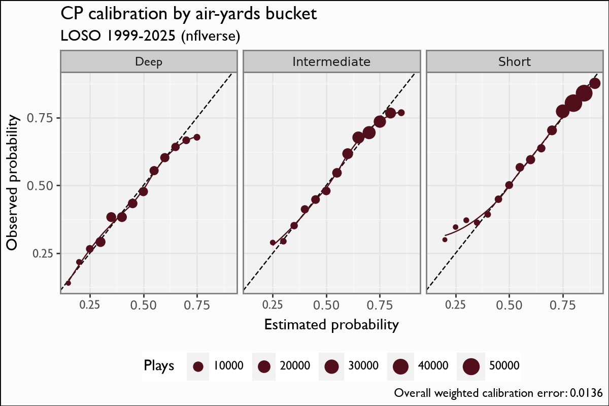
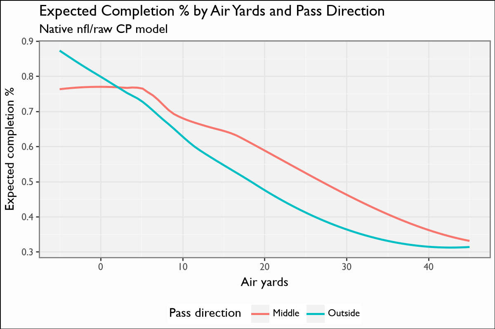

# Completion Probability / CPOE

## Overview

The Completion Probability (CP) model estimates the probability a given pass
attempt is completed (`cp`) from pre-throw game state and the throw geometry.
**CPOE** is the **percentage-point residual** `100 · (complete_pass − cp)`:
positive when a passer completes throws a league-average passer would not. It is
a faithful re-implementation of the nflfastR CP/CPOE model
(nflverse `fastrmodels`, Ben Baldwin).

## Model features

**18 features**; the binary label is `complete_pass`. CP depends on `air_yards`
charting, reliable from **2006** onward, so only the 2006+ era one-hots
(`era2..4`) are carried.

| Feature | Type | What it encodes |
|---|---|---|
| `air_yards` | numeric | Distance the ball travels in the air — the dominant completion driver. |
| `distance_to_sticks` | numeric | `air_yards − ydstogo`: how far past the first-down marker the throw targets. |
| `air_is_zero` | binary | Behind-LOS / screen indicator (`air_yards == 0`). |
| `pass_middle` | binary | Throw is over the middle of the field. |
| `qb_hit` | binary | QB was hit on the play (pressure proxy). |
| `yardline_100` | numeric | Field position (compresses depth near the goal line). |
| `ydstogo` | numeric | Yards to go. |
| `down1` … `down4` | one-hot | Current down (4 columns). |
| `home` | binary | Possession team is home. |
| `dome` / `retractable` / `outdoors` | binary | Stadium-type one-hots (wind/weather proxy). |
| `era2` … `era4` | one-hot | Rule era from 2006 (cuts 2013 / 2017). |

## The model

**Algorithm.** XGBoost, `objective=binary:logistic`, `eta=0.025`, `max_depth=4` —
the `fastrmodels` CP recipe. The predicted `cp` is the completion probability;
**CPOE = `100 · (complete_pass − cp)`** on a percentage-point scale. Trained on
**339,706 charted pass attempts** (1999–2025 range; air-yards era 2006+).

> **Sign note.** `distance_to_sticks` is `air_yards − ydstogo` — a historically
> sign-flipped input that was corrected in the shipped CP feature builder; it is
> pinned here so the parity holds.

**Evaluation.** nflfastR parity: CPOE is **scale-correct** on the percentage-point
scale against nflverse (see [Parity](parity.md)).

## Calibration Results

Leave-one-season-out, binned predicted `cp` vs empirical completion rate,
**faceted by air-yards bucket** (the nflfastR CP signature — completion
probability is a strong, monotone function of throw depth), via the NFL
model-report tool. On the **1999–2025** LOSO pool (339,706 throws): CP weighted
calibration error **0.0136**, Brier **0.192**.

## Feature importance

`air_yards` and `distance_to_sticks` dominate (throw depth is everything for
completion), with `air_is_zero` / `pass_middle` / `qb_hit` refining short and
pressured throws; the stadium and era one-hots apply small level shifts.

## Limitations

CP is blind to receiver separation and coverage we do not chart, so CPOE captures
the *geometry-and-state-explainable* part of completion only. Air-yards charting
is unreliable before 2006, so CP is an air-yards-era surface. CPOE is a
per-throw residual; aggregate it over a meaningful sample before reading it as
passer skill.

## Provenance

| field | value |
|---|---|
| `model_type` | cp |
| `objective` | binary:logistic |
| `features` | 18 (see above) |
| `label` | complete_pass |
| `training_seasons` | 1999–2025 (air-yards era 2006+) |
| `n_training_rows` | 339,706 |
| `hyperparameters` | eta=0.025, max_depth=4 |
| `lineage` | nflfastR CP/CPOE model · nflverse `fastrmodels` (Ben Baldwin) |
| `parity` | `cpoe` scale-correct (percentage points) |
