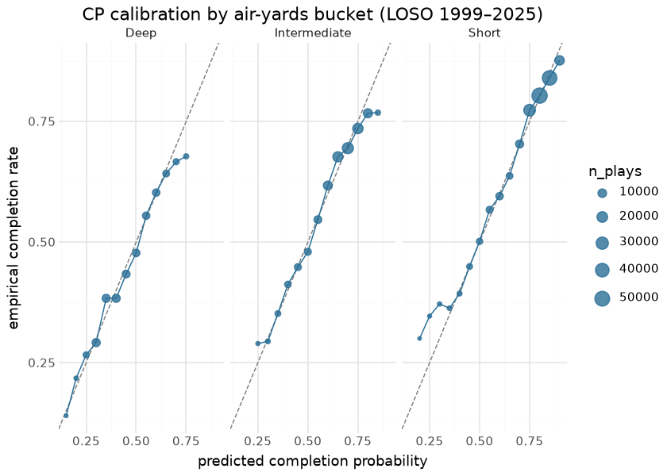
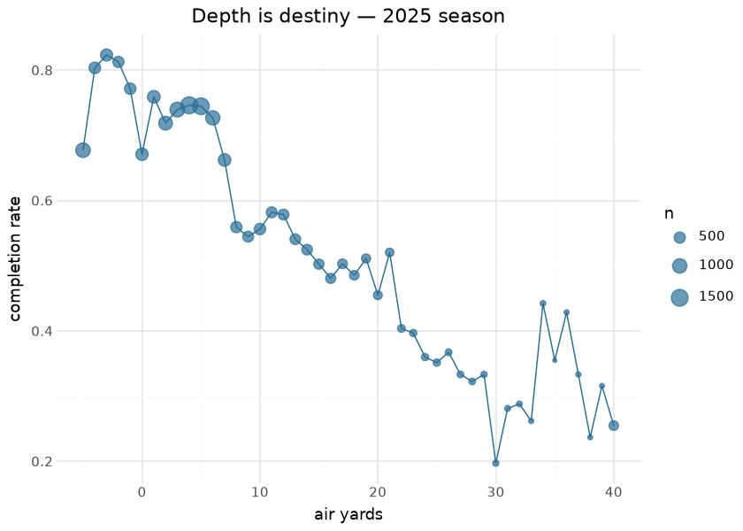
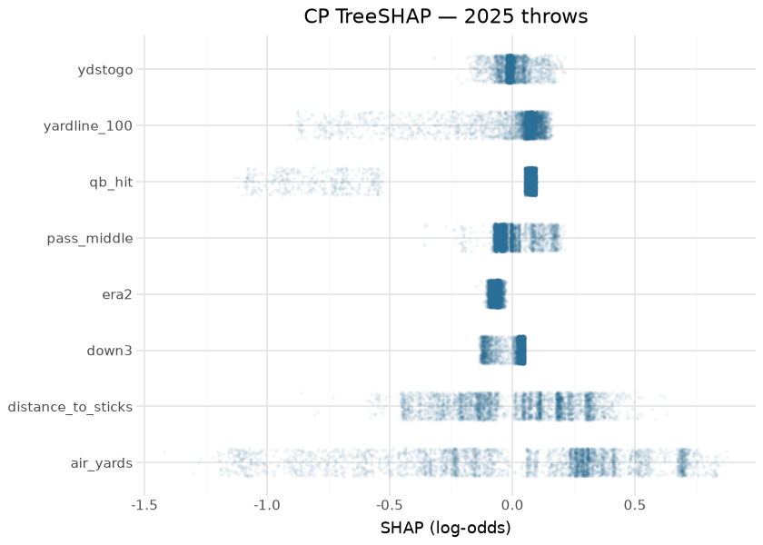

# Completion Probability / CPOE

The Completion Probability (CP) model estimates the probability a given
pass attempt is completed (`cp`) from pre-throw game state and the throw
geometry. **CPOE** is the **percentage-point residual**
`100 · (complete_pass − cp)`: positive when a passer completes throws a
league-average passer would not. It is a faithful re-implementation of
the nflfastR CP/CPOE model (nflverse `fastrmodels`, Ben Baldwin).

This document is compiled: the LOSO calibration re-plots from the
committed report artifacts, and the SHAP and passer-leaderboard sections
score the committed booster and the published season at render time.

## Model features

**18 features**; the binary label is `complete_pass`. CP depends on
`air_yards` charting, reliable from **2006** onward, so only the 2006+
era one-hots (`era2..4`) are carried.

| Feature | Type | What it encodes |
|----|----|----|
| `air_yards` | numeric | Distance the ball travels in the air — the dominant completion driver. |
| `distance_to_sticks` | numeric | `air_yards − ydstogo`: how far past the first-down marker the throw targets. |
| `air_is_zero` | binary | Behind-LOS / screen indicator (`air_yards == 0`). |
| `pass_middle` | binary | Throw is over the middle of the field. |
| `qb_hit` | binary | QB was hit on the play (pressure proxy). |
| `yardline_100` | numeric | Field position (compresses depth near the goal line). |
| `ydstogo` | numeric | Yards to go. |
| `down1` … `down4` | one-hot | Current down (4 columns). |
| `home` | binary | Possession team is home. |
| `dome` / `retractable` / `outdoors` | binary | Stadium-type one-hots (wind/weather proxy). |
| `era2` … `era4` | one-hot | Rule era from 2006 (cuts 2013 / 2017). |

## The model

**Algorithm.** XGBoost, `objective=binary:logistic`, `eta=0.025`,
`max_depth=4` — the `fastrmodels` CP recipe. The predicted `cp` is the
completion probability; **CPOE = `100 · (complete_pass − cp)`** on a
percentage-point scale. Trained on **339,706 charted pass attempts**
(1999–2025 range; air-yards era 2006+).

> **Sign note.** `distance_to_sticks` is `air_yards − ydstogo` — a
> historically sign-flipped input that was corrected in the shipped CP
> feature builder; it is pinned here so the parity holds.

**Evaluation.** nflfastR parity: CPOE is **scale-correct** on the
percentage-point scale against nflverse (see [Parity](parity.md)).

## Calibration Results

Leave-one-season-out, binned predicted `cp` vs empirical completion
rate, **faceted by air-yards bucket** (the nflfastR CP signature —
completion probability is a strong, monotone function of throw depth).
On the **1999–2025** LOSO pool (339,706 throws): CP weighted calibration
error **0.0136**, Brier **0.192**.

## Feature importance & SHAP

| Top 12 features by gain — committed CP booster |       |
|------------------------------------------------|-------|
| feature                                        | gain  |
| qb_hit                                         | 327.5 |
| distance_to_sticks                             | 287.8 |
| air_yards                                      | 269.1 |
| yardline_100                                   | 88.5  |
| era2                                           | 70.3  |
| pass_middle                                    | 54.5  |
| air_is_zero                                    | 50.2  |
| era3                                           | 49.3  |
| down3                                          | 35.2  |
| ydstogo                                        | 24.0  |
| outdoors                                       | 17.1  |
| down2                                          | 15.9  |

&#10;

`air_yards` and `distance_to_sticks` dominate (throw depth is everything
for completion), with `air_is_zero` / `pass_middle` / `qb_hit` refining
short and pressured throws; the stadium and era one-hots apply small
level shifts.

## Results — 2025 CPOE leaders

| CPOE leaders — 2025 (min 150 charted attempts) |  |  |  |  |  |
|----|----|----|----|----|----|
| percentage points of completion over the geometry-expected rate |  |  |  |  |  |
|  | Passer | Team | Att | Comp% | CPOE |
|  | D.Maye | NE | 612 | 69.3% | 4.42 |
|  | J.Allen | BUF | 534 | 69.7% | 1.60 |
|  | B.Purdy | SF | 342 | 67.3% | 1.40 |
|  | J.Burrow | CIN | 259 | 66.8% | 1.23 |
|  | M.Jones | SF | 293 | 69.3% | 0.66 |
|  | D.Prescott | DAL | 600 | 67.3% | 0.49 |
|  | S.Darnold | SEA | 568 | 66.7% | 0.39 |
|  | D.Jones | IND | 384 | 68.0% | 0.34 |
|  | S.Rattler | NO | 257 | 67.7% | 0.04 |
|  | J.Herbert | LAC | 543 | 66.1% | −0.07 |

&#10;

## Limitations

CP is blind to receiver separation and coverage we do not chart, so CPOE
captures the *geometry-and-state-explainable* part of completion only.
Air-yards charting is unreliable before 2006, so CP is an air-yards-era
surface. CPOE is a per-throw residual; aggregate it over a meaningful
sample before reading it as passer skill.

## Provenance

| field | value |
|----|----|
| `model_type` | cp |
| `objective` | binary:logistic |
| `features` | 18 (see above) |
| `label` | complete_pass |
| `training_seasons` | 1999–2025 (air-yards era 2006+) |
| `n_training_rows` | 339,706 |
| `hyperparameters` | eta=0.025, max_depth=4 |
| `lineage` | nflfastR CP/CPOE model · nflverse `fastrmodels` (Ben Baldwin) |
| `parity` | `cpoe` scale-correct (percentage points) |
| `artifact` | `models/cp_model.ubj` (committed; also on `nfl_model_artifacts`) |
| `rebuild this doc` | `scripts/render_model_docs.sh` (Quarto → GFM; `uv sync --group docs`) |

## Avenues for improvement & open issues

- **Separation/coverage features** — public pbp lacks them; NGS-derived
  aggregates are the plausible lever.
- **Known issue:** CPOE is percentage-point scaled (100x) by convention
  — consumers routinely mis-scale it; the column doc must stay loud.
