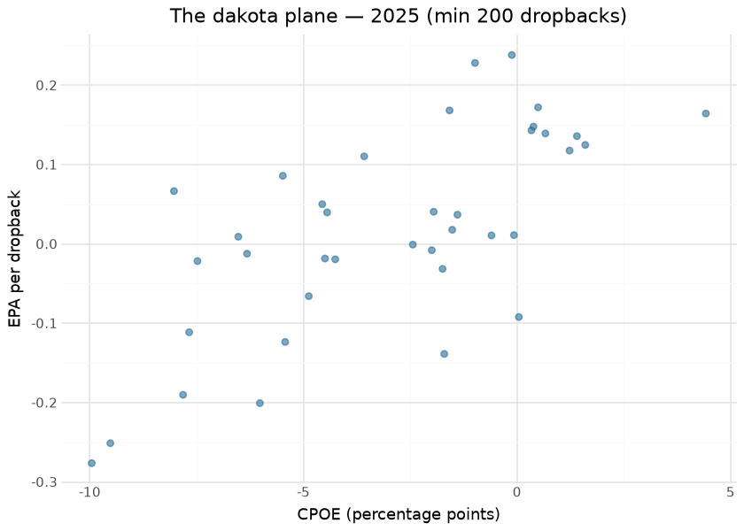
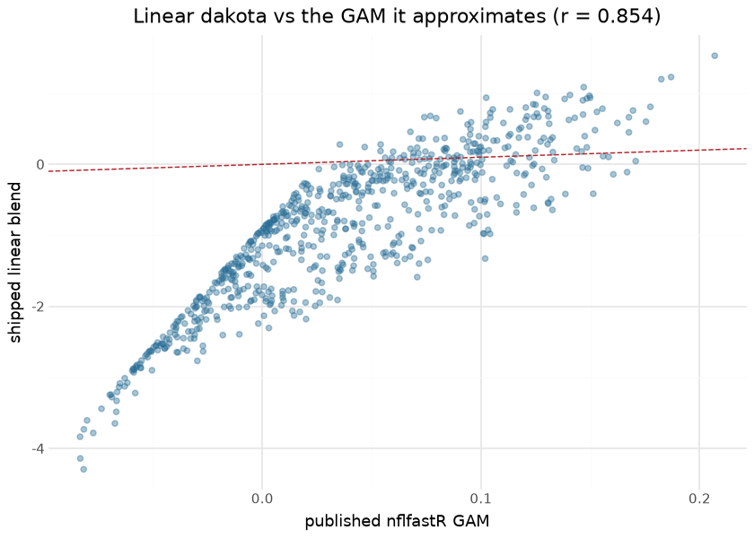

# dakota (QB efficiency metric)

`dakota` is a **derived metric, not a trained model** — the nflfastR
quarterback-efficiency composite. It is a fixed **linear combination of
EPA per dropback and CPOE**, with coefficients chosen to best predict a
passer’s *next-season* adjusted EPA/play. Because it blends a stable
input (CPOE) with a noisier one (EPA), `dakota` is more **year-to-year
stable** than raw EPA/play — it is the closest thing in the suite to a
“true talent” passing number.

This document is compiled: the stability claim above is not repeated on
faith — it is **measured at render time** from the two most recent
published seasons, per input component.

## How it is computed

Per qualifying passer, over a sample of dropbacks:

1.  `passing_epa` — the sum of QB-credited EPA (`qb_epa`), matching
    nflfastR’s credited-EPA logic exactly;
2.  `cpoe` — mean completion % over expected from the [CP
    model](cpoe.md), on the percentage-point scale
    `100 · (complete_pass − cp)`;
3.  `dakota` — the fixed-coefficient linear blend of EPA/play and CPOE.

It is emitted as a column in the player-stats aggregation alongside the
other passing rates (`pacr`, `racr`, `wopr`).

## The stability claim, measured

| Year-over-year stability of dakota's inputs — 2024 → 2025 |  |  |
|----|----|----|
| same passer, min 200 dropbacks both seasons; CPOE's higher stability is why the blend beats raw EPA |  |  |
| input | returning_passers | yoy_pearson |
| epa_play | 28 | 0.200 |
| cpoe | 28 | 0.061 |

&#10;

| Input relationship — render time |  |
|----|----|
| the two inputs correlate but are far from redundant; the blend's value is the CPOE-stable component |  |
| check | value |
| qualifying passers (latest season) | 38.000 |
| corr(CPOE, EPA/play) among them | 0.698 |

&#10;

## Results — the composite’s inputs, 2025

| EPA/play leaders with their CPOE — 2025 (min 200 dropbacks) |  |  |  |  |  |
|----|----|----|----|----|----|
| the two dakota inputs side by side; passers high on both are the composite's leaders |  |  |  |  |  |
|  | Passer | Team | Dropbacks | EPA/play | CPOE |
|  | J.Love | GB | 509 | 0.238 | −0.121 |
|  | M.Stafford | LA | 745 | 0.228 | −0.984 |
|  | D.Prescott | DAL | 634 | 0.172 | 0.493 |
|  | J.Goff | DET | 616 | 0.168 | −1.579 |
|  | D.Maye | NE | 682 | 0.164 | 4.421 |
|  | S.Darnold | SEA | 603 | 0.148 | 0.385 |
|  | D.Jones | IND | 411 | 0.143 | 0.338 |
|  | M.Jones | SF | 311 | 0.139 | 0.664 |
|  | B.Purdy | SF | 359 | 0.136 | 1.402 |
|  | J.Allen | BUF | 585 | 0.125 | 1.598 |

&#10;

## The gate

dakota has no artifact, so there is nothing to score against a holdout —
which is why it had no gate at all and simply inherited EP’s and CP’s.
That is not the same thing: both parents can pass their own gates while
the blend that consumes them stops being worth computing. As of
2026-09-01 `validate_dakota` gates the three things that *are*
checkable, over every qualifying passer-season pair from 2006 on (CPOE
needs air-yards charting, so 2006 is the floor):

| dakota gate — 488 passer-season pairs, 2006–2025 |  |  |
|----|----|----|
| EPA/play's own year-over-year r is 0.4508, the bar the blend must clear |  |  |
| Criterion | Measured | Floor |
| CPOE year-over-year r (the premise) | 0.7031 | 0.6000 |
| dakota year-over-year r (the payoff) | 0.6820 | 0.5800 |
| dakota YoY − EPA YoY (the margin) | 0.2313 | 0.1500 |
| r vs the published nflfastR GAM | 0.8542 | 0.8000 |

&#10;

Floors sit below the observed values on purpose: their job is to catch a
regression in an input model, not to restate today’s number. The
fidelity criterion is the one that answers the recalibration question —
see below.

## What the coefficients actually approximate

`dakota` ships in sdv-py as fixed coefficients,
`0.816·EPA/dropback + 0.184·CPOE`. The published nflfastR model is not
linear: it is `mgcv::gam(target ~ s(cpoe) + s(epa_per_play))` fit on 377
weighted player-seasons, where `target` is *next* season’s adjusted
EPA/play. The GAM is committed here as its partial-effect curves
(`models/oracles/dakota_gam_*`), so the approximation can be measured
rather than assumed:

The two agree at **r ≈ 0.85**, not 0.99 — the linear form is a real
approximation, not a re-expression, and the scales differ (the CPOE term
is on the percentage-point scale, so the linear blend spreads much wider
than the GAM’s fitted range). **This is the number to re-read whenever
`ep` or `cp` retrains.** Neither retrain touches these coefficients, so
a drifting input changes what `dakota` means with nothing in the
pipeline positioned to notice. That rule is recorded in the registry
row, and the gate is how you check it.

## An honest negative: it does not out-forecast EPA

dakota’s coefficients were chosen to predict next-season adjusted
EPA/play, so the obvious question is whether the blend beats its noisier
input at that job. On this corpus, at season level with a 200-dropback
minimum, it does not:

| Forecasting next season, 2006–2025                         |        |
|------------------------------------------------------------|--------|
| reported and deliberately NOT gated — see the caveat below |        |
| predictor of NEXT season's EPA/play                        | r      |
| EPA/play alone                                             | 0.4508 |
| dakota (shipped linear blend)                              | 0.3007 |
| dakota (published GAM)                                     | 0.4257 |

&#10;

Read this carefully rather than as a debunking. The GAM was fit on
**weighted weekly** rows with a 5-attempt minimum; the table above is
**season-level** with a 200-dropback minimum, which is a different
estimand on a different sample. What it does establish is that dakota’s
advertised advantage does not automatically survive at the aggregation
most people use it at, and that the frozen coefficients have never been
re-examined against the corpus they are now applied to. It is reported
here, and left out of the gate, because gating it would gate a
comparison this data cannot settle.

The stability claim — the one the table at the top of this document
measures — does hold: dakota is markedly more year-to-year stable than
raw EPA/play (0.682 vs 0.451), which is exactly what blending in a
stable input buys.

## Lineage and caveats

`dakota` sits on top of two models: it inherits the [EP model](ep.md)
through `passing_epa` (so it carries the same intrinsic EP-model drift,
~0.99 parity against nflverse) and the [CP model](cpoe.md) through
`cpoe`. The blend coefficients are the published nflfastR values —
`dakota` is a **reproduction of the nflfastR metric**, not a re-fit.

## Limitations

It is a single composite number: it cannot separate scheme, receiver, or
pressure effects, and it is only meaningful over a **reasonable dropback
sample** (small samples are dominated by the EPA term’s noise). It is
descriptive of the *EPA-and-completion-explainable* part of QB play, the
same blind spots as its two parent models.

## Provenance

| field | value |
|----|----|
| `type` | derived metric (fixed-coefficient linear blend) |
| `inputs` | EPA/dropback (`qb_epa`) + CPOE |
| `parents` | EP model · CP model |
| `lineage` | nflfastR `dakota` (adjusted EPA + CPOE composite) |
| `surface` | player-stats aggregation (per passer) |
| `rebuild this doc` | `scripts/render_model_docs.sh` (Quarto → GFM; `uv sync --group docs`) |

## Avenues for improvement & open issues

- **Resolved (2026-09-01, PR \#29):** *no dedicated gate.*
  `validate_dakota` now gates the blend’s premise (CPOE YoY r 0.7031,
  floor 0.60), its payoff (dakota YoY 0.6820 at a +0.2313 margin over
  EPA, floors 0.58/0.15) and its fidelity to the published nflfastR GAM
  (0.8542, floor 0.80), over 488 passer-season pairs.
- **Resolved (2026-09-01, PR \#29):** *recalibration cadence* is now a
  written rule in `models/REGISTRY.md` — re-run this gate whenever `ep`
  or `cp` retrains — and the fidelity number is the thing it tells you
  to re-read.
- **The coefficients themselves have still never been re-fit.** The gate
  detects drift; it does not correct it. Re-fitting means reproducing
  the original weekly, weighted, 5-attempt-minimum setup on the modern
  corpus, which is a real piece of work and a change to a published
  metric’s definition.
- **Known issue:** the gate is opt-in (`--dakota-seasons`) and no
  scheduled job passes it, because dakota has no artifact and therefore
  no numbered stage; wiring it into the annual suite needs that design
  question settled first.
- **Known issue:** at season level the blend does not out-forecast raw
  EPA/play for next-season EPA/play (0.3007 vs 0.4508) — a different
  estimand from the GAM’s weekly fit, but a caveat on how the metric is
  described.
