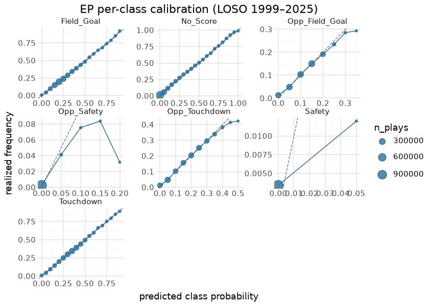
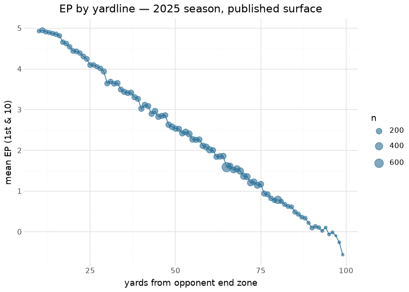
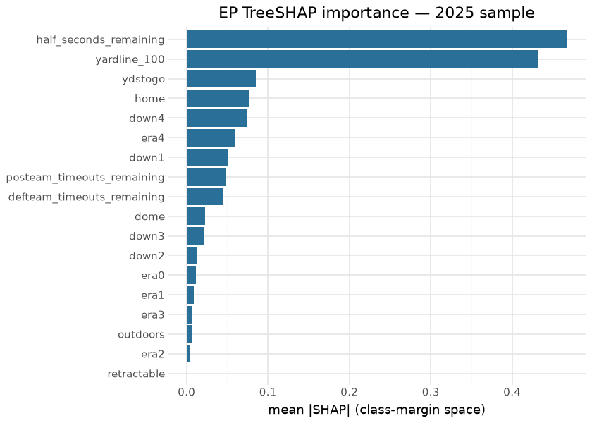

# Expected Points (EP)

The Expected Points (EP) model estimates the expected next-score value
for the team in possession at the **start of a play**, given game state.
It is the foundation of the NFL analytics stack: EP differences between
consecutive plays define **Expected Points Added (EPA)**. Every
play-by-play row carries an `ep` column plus the seven next-score class
probabilities. The model is a faithful re-implementation of the nflfastR
EP model (nflverse `fastrmodels`, Ben Baldwin).

This document is compiled: the calibration sections re-plot from the
committed LOSO report artifacts (`figures/*.parquet`, produced by the
training pipeline’s reporting stage over the full 1999–2025 corpus), and
the importance/SHAP and results sections score the committed booster
(`models/ep_model.ubj`) over the latest published `nfl_model_pbp` season
at render time.

## Model features

**18 features**, all known at the **start of the play** — no look-ahead.
Each row is one scrimmage play; the label is the *next scoring event* in
the same half (`next_score_class`).

| Feature | Type | What it encodes |
|----|----|----|
| `half_seconds_remaining` | numeric | Seconds left in the half — fewer expected possessions to score late. |
| `yardline_100` | numeric | Distance (1–99) to the opponent’s end zone — the strongest field-position signal. |
| `ydstogo` | numeric | Yards to go for a first down. |
| `down1` … `down4` | one-hot | Current down (4 columns). |
| `home` | binary | Possession team is home. |
| `dome` / `retractable` / `outdoors` | binary | Stadium-type one-hots (roof/exposure) — NFL EP carries a weather/venue proxy CFB does not. |
| `era0` … `era4` | one-hot | Rule era (cuts **2001 / 2005 / 2013 / 2017**) — captures scoring-environment drift across 27 seasons. |
| `posteam_timeouts_remaining` | numeric | Possession-team timeouts left. |
| `defteam_timeouts_remaining` | numeric | Defense timeouts left. |

## The model

**Algorithm.** XGBoost gradient-boosted trees,
`objective=multi:softprob` over `num_class=7`, `eval_metric=mlogloss`,
`eta=0.025`, `max_depth=5` — the `fastrmodels` EP recipe. The 7 class
probabilities are dotted with the nflfastR point map to produce a scalar
EP:

`{Touchdown:+7, Opp_Touchdown:−7, Field_Goal:+3, Opp_Field_Goal:−3, Safety:+2, Opp_Safety:−2, No_Score:0}`

(class order
`0=TD, 1=Opp_TD, 2=FG, 3=Opp_FG, 4=Safety, 5=Opp_Safety, 6=No_Score`).
Retrained on the **full 1999–2025 history (1,195,636 plays)** reshaped
from `nfl-raw` to nflfastR parity.

**Evaluation.** Two lenses — see [Parity](parity.md) for the
nflfastR-parity gate and the LOSO calibration below.

## Training data (LOSO report) and the render-time season

| EP evaluation corpora |  |  |
|----|----|----|
| the LOSO metrics are frozen training-report artifacts; the render-time season is live |  |  |
| corpus | plays | per_class_weighted_cal_error |
| LOSO pool (training report, 1999–2025) | 1,195,636 | 0.0058 |
| render-time season (2025, nfl_model_pbp) | 46,631 | <na> |

&#10;

## Calibration

A 7-class softprob model is checked **per next-score class** — each
class probability binned against whether that class was the realized
next score (the nflfastR / cfbscrapR signature). This is a
**probability-scale** reliability check, directly comparable to the WP
and CP numbers. On the **1999–2025** leave-one-season-out pool the
**per-class weighted calibration error is 0.0058** — on par with WP
(0.0026) and better than CP (0.0136). The high-variance modal class
(`No_Score`, 0.012) carries most of the error; the rare scoring classes
(safeties, 0.003) are tight.

> [!NOTE]
>
> ### Why not a single points-scale number
>
> Binning the scalar `ep` against realized next-score *value* reads
> ≈0.07 **points**, but that is dominated by the absolute level of the
> next-score label — nflfastR’s own `ep` sits the same ~0.1 points above
> the realized-next-score mean — so it is **not** comparable to the
> probability-scale figures above, nor to WP/CP. The per-class
> reliability and the parity (`ep` r 0.996) are the honest, comparable
> signals; the model is not miscalibrated.

The EP-by-yardline curve rises smoothly from own-goal-line to a sharp
red-zone climb — the shape that makes EPA a meaningful per-play
currency.

## Feature importance & SHAP

| Top 12 features by gain — committed EP booster |       |
|------------------------------------------------|-------|
| feature                                        | gain  |
| half_seconds_remaining                         | 197.1 |
| down4                                          | 109.5 |
| yardline_100                                   | 108.7 |
| down1                                          | 91.6  |
| down2                                          | 77.8  |
| down3                                          | 65.0  |
| ydstogo                                        | 61.8  |
| defteam_timeouts_remaining                     | 56.5  |
| posteam_timeouts_remaining                     | 40.5  |
| home                                           | 14.9  |
| era4                                           | 12.3  |
| era0                                           | 10.2  |

&#10;

`yardline_100` dominates (field position is the backbone of EP),
followed by `half_seconds_remaining` and the down one-hots; the era and
stadium one-hots apply level shifts rather than driving the surface —
matching the nflfastR EP post. Because EP is a softprob dot-product,
exact SHAP exists per class margin, not for the scalar `ep`; the chart
aggregates \|contribution\| across the seven margins and is labeled
accordingly.

## Results — the surface in use

| Top 10 offenses by EPA/play — 2025 season |  |  |  |
|----|----|----|----|
| EPA is the first difference of this model's EP surface |  |  |  |
|  | Offense | Plays | EPA/play |
|  | LA | 1,261 | 0.144 |
|  | BUF | 1,203 | 0.125 |
|  | GB | 1,063 | 0.113 |
|  | DAL | 1,104 | 0.098 |
|  | DET | 1,051 | 0.084 |
|  | NE | 1,268 | 0.077 |
|  | IND | 1,011 | 0.069 |
|  | CHI | 1,255 | 0.065 |
|  | SF | 1,180 | 0.054 |
|  | SEA | 1,184 | 0.038 |

&#10;

## Limitations

EP is a **start-of-play** quantity; it does not know the result of the
current play (that is what EPA captures). Top-1 class accuracy is
inherently capped by irreducible next-score noise, not miscalibration —
the model is well-calibrated in aggregate even where individual outcomes
are unpredictable. The 7-class point map is fixed, and the model is
blind to personnel and in-play participants by design.

## Provenance

| field | value |
|----|----|
| `model_type` | ep |
| `objective` | multi:softprob (num_class=7) |
| `features` | 18 (see above) |
| `label` | next_score_class |
| `training_seasons` | 1999–2025 |
| `n_training_rows` | 1,195,636 |
| `hyperparameters` | eta=0.025, max_depth=5 |
| `lineage` | nflfastR EP model · nflverse `fastrmodels` (Ben Baldwin) |
| `parity` | `ep` r 0.996 · `epa` r 0.994 |
| `artifact` | `models/ep_model.ubj` (committed; also on `nfl_model_artifacts`) |
| `rebuild this doc` | `scripts/render_model_docs.sh` (Quarto → GFM; `uv sync --group docs`) |

## Avenues for improvement & open issues

- **Era interactions** — era dummies were evaluated and rejected on
  calibration; richer era x feature interactions (kickoff rules, OT
  format) remain unexplored.
- **Known issue:** kickoff/PAT rows depend on the feature-substitution
  convention (touchback yardline, down/ydstogo resets) — any rule change
  (e.g. dynamic kickoff) requires revisiting those constants before
  retrain.
