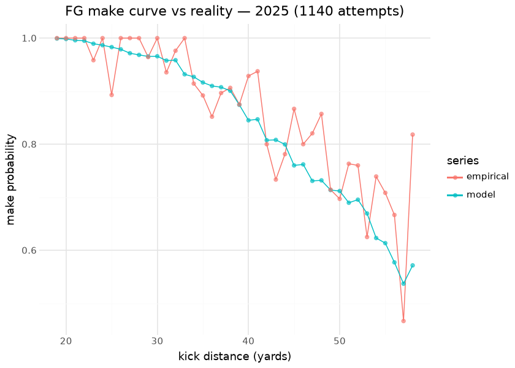

# Field Goal (`fg_model`)

The field-goal model estimates the probability a placekick is **made**,
given the kick distance and roof/era context. It powers the field-goal
branch of the [nfl4th 4th-down decision](fourth_down.md): the EV of
attempting a field goal is this make probability times three points. It
is a Python **XGBoost** retrain of nfl4th’s FG model — which was
originally an **mgcv GAM spline** — validated against the converted GAM
grid.

This document is compiled: the make-probability curve is scored from the
bundled booster at render time and overlaid on the latest published
season’s **empirical** make rates, and the kicker leaderboard scores
every 2025 attempt through the model to compute field goals over
expected.

## Model features

**7 features** (`yardline_100`, `fg_roof`, era0..era4); one row per FG
attempt (`play_type_nfl=='FIELD_GOAL'`, 1999–2025). The era one-hot
replaces the old binary `fg_era` so the make-prob curve is era-aware
across all kicking eras. The binary label is `sp` (field goal made).

| Feature | Type | What it encodes |
|----|----|----|
| `yardline_100` | numeric | Snap field position; kick distance is `yardline_100 + 17`. The dominant signal (**monotone ↓**). |
| `fg_roof` | binary | Outdoors (`roof=='outdoors'`) vs indoor/retractable. |
| `era0..4` | one-hot | Kicking era — the make curve has shifted outward era over era. |

## The model

**Algorithm.** XGBoost, `objective=binary:logistic`, shallow trees with
a high `min_child_weight` (the make curve is smooth), **monotone
constraint `−1` on `yardline_100`** (make probability must fall with
distance). Replaces the original mgcv GAM spline.

**Evaluation.** Because the booster step-approximates a spline, parity
is scoped to the **operating domain** (yardline×roof×era cells with ≥1
real attempt): **corr 0.9802** there (gate ≥0.98), **freq-weighted corr
0.9880**. Full-grid corr is lower by construction (0.9690) — the booster
cannot reproduce the spline’s extrapolation into never-attempted cells;
**max abs FG% diff 0.34**. See [Parity](parity.md).

## The make curve, against reality

| Render-time FG evaluation — 2025 attempts scored by the bundled booster |  |
|----|----|
| scored with era4 + roof features; monotone-in-distance by constraint |  |
| metric | value |
| 2025 attempts | 1,140.0000 |
| make rate | 0.8561 |
| Brier (model) | 0.1117 |
| baseline Brier (constant) | 0.1232 |

&#10;

## Results — field goals over expected, 2025

| Field goals over expected — 2025 (min 15 attempts) |  |  |  |  |  |  |
|----|----|----|----|----|----|----|
| made minus the model-expected makes on the same attempts; kicker identity is deliberately NOT a model feature, so this residual is the kicker |  |  |  |  |  |  |
|  | Kicker | Team | Att | Made | xMade | FGOE |
|  | E.Pineiro | SF | 32 | 31.0 | 26.0 | 5.0 |
|  | W.Reichard | MIN | 35 | 33.0 | 28.7 | 4.3 |
|  | N.Folk | NYJ | 29 | 28.0 | 23.9 | 4.1 |
|  | K.Fairbairn | HOU | 52 | 48.0 | 44.2 | 3.8 |
|  | E.McPherson | CIN | 28 | 25.0 | 21.7 | 3.3 |
|  | B.Aubrey | DAL | 42 | 36.0 | 33.0 | 3.0 |
|  | R.Patterson | MIA | 29 | 27.0 | 24.2 | 2.8 |
|  | C.Dicker | LAC | 42 | 39.0 | 36.5 | 2.5 |
|  | C.Little | JAX | 36 | 31.0 | 28.5 | 2.5 |
|  | J.Myers | SEA | 56 | 49.0 | 46.7 | 2.3 |

&#10;

## Where the 0.97 parity actually comes from

The FG model’s parity against the R oracle (attempted-cells corr ~0.97)
is the lowest of the boosters, so this section localizes it rather than
leaving it as a headline number. The oracle is the nfl4th `mgcv` GAM,
scored over its own grid and committed at
`models/oracles/fg_model_grid_nfl4th.csv` (provenance in that
directory’s README); the booster is scored over the same grid here.

| FG parity vs the nfl4th GAM, by kick distance |  |  |  |  |  |
|----|----|----|----|----|----|
| attempted cells only; the disagreement is not spread across the range |  |  |  |  |  |
| Distance | Cells | Attempts | corr vs GAM | mean \|diff\| | max \|diff\| |
| under 30 | 48 | 3353 | 0.9610 | 0.0046 | 0.0113 |
| 30-39 | 40 | 3681 | 0.9503 | 0.0090 | 0.0282 |
| 40-49 | 40 | 3785 | 0.9541 | 0.0122 | 0.0407 |
| 50-59 | 40 | 1883 | 0.8637 | 0.0473 | 0.2947 |
| 60+ | 24 | 86 | 0.6793 | 0.1725 | 0.3466 |

&#10;

**The residual is the long-distance tail, and nothing else.** Inside 50
yards — where 10,819 of the 12,788 attempted-cell attempts live — the
two models agree to a mean absolute make-probability difference of
0.005–0.012. From 50 yards the agreement degrades (0.047), and past 60
it collapses (0.173 mean, 0.347 max) on **86 attempts across 27
seasons**. That is the whole story of the headline number: the cells
that carry the disagreement are the cells almost nobody kicks from,
which is also why the frequency-weighted correlation (0.988) is so much
higher than the unweighted one.

The mechanism is the one the model card already names, now measured: the
GAM is a smooth spline that keeps extrapolating a graceful decline past
the attempted domain, while the booster is a monotone step function with
a `min_child_weight` floor, so it flattens where it has no data. Neither
is “right” out there — the GAM’s long tail is an extrapolation too, not
evidence.

Two candidate explanations that the data rules **out**:

| The same parity, sliced by era mapping and by roof |  |  |  |  |
|----|----|----|----|----|
| neither slice separates -- the era-cell mapping is not the cause |  |  |  |  |
| Slice | Cells | Attempts | corr vs GAM | mean \|diff\| |
| era3 (2014-17, grid fg_era=0) | 92 | 4171 | 0.9724 | 0.0447 |
| era4 (2018+, grid fg_era=1) | 100 | 8617 | 0.9731 | 0.0299 |
| indoor / retractable | 94 | 3903 | 0.9635 | 0.0438 |
| outdoors | 98 | 8885 | 0.9840 | 0.0305 |

&#10;

The era-cell mapping (the grid’s two-level `fg_era` is projected onto
era3/era4) is a natural suspect and it is not the cause — both era
slices land at the same correlation. Roof is a weak effect in the same
direction as sample size.

**Against reality, rather than against the GAM, the booster is well
calibrated** — which is the reading that matters for a model in
production:

| Model vs realized make rate by playing surface, 1999–2025 |  |  |  |  |
|----|----|----|----|----|
| surface is NOT a model feature; a large bias here would be a real gap |  |  |  |  |
| Surface | Attempts | Empirical | Model | Bias |
| grass | 13506 | 0.8250 | 0.8267 | 0.0017 |
| fieldturf | 6628 | 0.8435 | 0.8430 | −0.0006 |
| sportturf | 1325 | 0.8483 | 0.8455 | −0.0028 |
| astroturf | 1114 | 0.8214 | 0.8293 | 0.0080 |
| matrixturf | 869 | 0.8826 | 0.8581 | −0.0245 |
| astroplay | 426 | 0.8169 | 0.8284 | 0.0115 |
| a_turf | 390 | 0.8436 | 0.8508 | 0.0072 |
| grass | 337 | 0.8487 | 0.8428 | −0.0059 |
| dessograss | 201 | 0.8159 | 0.8339 | 0.0180 |

&#10;

Every surface with a usable sample sits within 0.025 of its realized
make rate, and most within 0.01. Per-season bias behaves the same way
(mostly under 0.02). **So the honest verdict on the 0.97: it is a
disagreement between two functional forms in a region neither has data
for, not a defect in the shipped model.** It should not be “fixed” by
chasing the GAM into the extrapolated tail.

## Weather and altitude: measured, not modelled

The card lists weather as an absent feature. Here is what it is worth,
as a residual analysis on outdoor attempts (the schedule carries `temp`
and `wind`):

| FG residual by wind and temperature — 17,445 outdoor attempts |  |  |  |  |  |
|----|----|----|----|----|----|
| residual = made - model; a monotone gradient is unmodelled signal |  |  |  |  |  |
| Variable | Bucket | Attempts | Empirical | Model | Mean residual |
| wind (mph) | \[-inf, 5) | 3663 | 0.8515 | 0.8266 | 0.0249 |
| wind (mph) | \[5, 10) | 7615 | 0.8263 | 0.8252 | 0.0011 |
| wind (mph) | \[10, 15) | 4001 | 0.8173 | 0.8276 | −0.0103 |
| wind (mph) | \[15, 20) | 1586 | 0.8083 | 0.8326 | −0.0243 |
| wind (mph) | \[20, inf) | 580 | 0.8155 | 0.8462 | −0.0307 |
| temp (F) | \[-inf, 32) | 1071 | 0.8058 | 0.8473 | −0.0415 |
| temp (F) | \[32, 50) | 4169 | 0.8249 | 0.8385 | −0.0136 |
| temp (F) | \[50, 70) | 7308 | 0.8307 | 0.8245 | 0.0063 |
| temp (F) | \[70, inf) | 4897 | 0.8297 | 0.8180 | 0.0117 |

&#10;

Both gradients are monotone and material: kicks in under 5 mph beat the
model by **+2.5 points of make probability** and kicks in 20+ mph fall
short by **−3.1**, a 5.6-point spread the model currently attributes to
nothing. Temperature runs the same way (**−4.2** below freezing to
**+1.2** above 70°F), though wind and cold co-occur, so these are not
independent effects — a joint fit would split less signal between them
than the two tables suggest separately.

| Altitude, by the crudest possible proxy: is the game in Denver? |  |  |  |
|----|----|----|----|
| Denver kicks beat the model despite being LONGER on average |  |  |  |
| Denver | Attempts | Mean residual | Mean distance (yd) |
| False | 17162 | −0.0006 | 36.2682 |
| True | 795 | 0.0298 | 37.5447 |

&#10;

Denver attempts beat the model by **+3.1 points** while being **1.2
yards longer** on average — the sign and magnitude thin air predicts.
This is a proxy, not an altitude feature: a real one needs a
stadium-elevation table, which does not exist in the nflverse schedule.
**The source to use is the USGS Elevation Point Query Service**
(`https://epqs.nationalmap.gov/v1/json?x=<lon>&y=<lat>`; free, no key,
US-only, which covers every NFL venue except the international games)
keyed by stadium coordinates, committed as a ~40-row
`stadium_id -> elevation_m` lookup. That table is the missing input;
nothing else blocks the feature.

None of this is a retrain — it is a measurement of what a retrain would
have to gain. Adding `wind`, `temp` and elevation to a model whose only
real feature is distance is a materially different model, and it
inherits a new dependency (schedule weather is missing or wrong for some
older games), so it belongs in a gated retrain rather than in this
document.

## Limitations

Distance is everything plus a coarse roof/era shift — **no kicker
identity, wind, or weather**, and the section above quantifies what the
last two cost. The step-function booster does not extrapolate the smooth
GAM tail past the attempted domain, so very long / never-attempted cells
should be read with caution (this is the freq-weighted vs full-grid corr
gap). The render-time scoring above pins era4 for current-season
attempts, which is exact for 2018+.

## Provenance

| field | value |
|----|----|
| `model_type` | fg |
| `objective` | binary:logistic (monotone yardline ↓) |
| `features` | yardline_100, fg_roof, era0..4 |
| `label` | sp (FG made) |
| `training_seasons` | 1999–2025 (23,919 attempts) |
| `lineage` | nfl4th field-goal model (was mgcv GAM) |
| `parity` | attempted-cells corr 0.971 · freq-weighted 0.986 (informational, era-aware full-history) |
| `distribution` | bundled in sportsdataverse |
| `rebuild this doc` | `scripts/render_model_docs.sh` (Quarto → GFM; `uv sync --group docs`) |

## Avenues for improvement & open issues

- **Resolved (2026-09-01, PR \#29):** *the 0.97 parity audit.* The
  residual is the long-distance tail and nothing else: corr vs the GAM
  is 0.961 under 30 yards, 0.950 at 30-39, 0.954 at 40-49, 0.864 at
  50-59 and 0.679 at 60+ (86 attempts in 27 seasons). Era mapping and
  roof do not separate. Against reality the booster is well calibrated
  (per-surface bias \<= 0.025), so the number is a functional-form
  disagreement in a region neither model has data for – an honest
  residual, not a defect to chase.
- **Resolved (2026-09-01, PR \#29):** *weather measured.* Wind and
  temperature carry monotone, unmodelled residual gradients (+2.5 to
  -3.1 points of make probability across wind buckets; -4.2 to +1.2
  across temperature), and Denver kicks beat the model by 3.1 points
  while being 1.2 yards longer.
- **Altitude still needs a source**, named in the card: a
  stadium-elevation lookup from the USGS Elevation Point Query Service
  keyed by venue coordinates. Until that ~40-row table is committed,
  “altitude” is a Denver dummy.
- **Kicker aging** remains unexamined; kicker identity is deliberately
  the FGOE residual, which is the leaderboard’s point.
- **Known issue:** wind and cold co-occur, so the two weather tables
  above double-count shared signal – a joint fit would attribute less to
  each.
