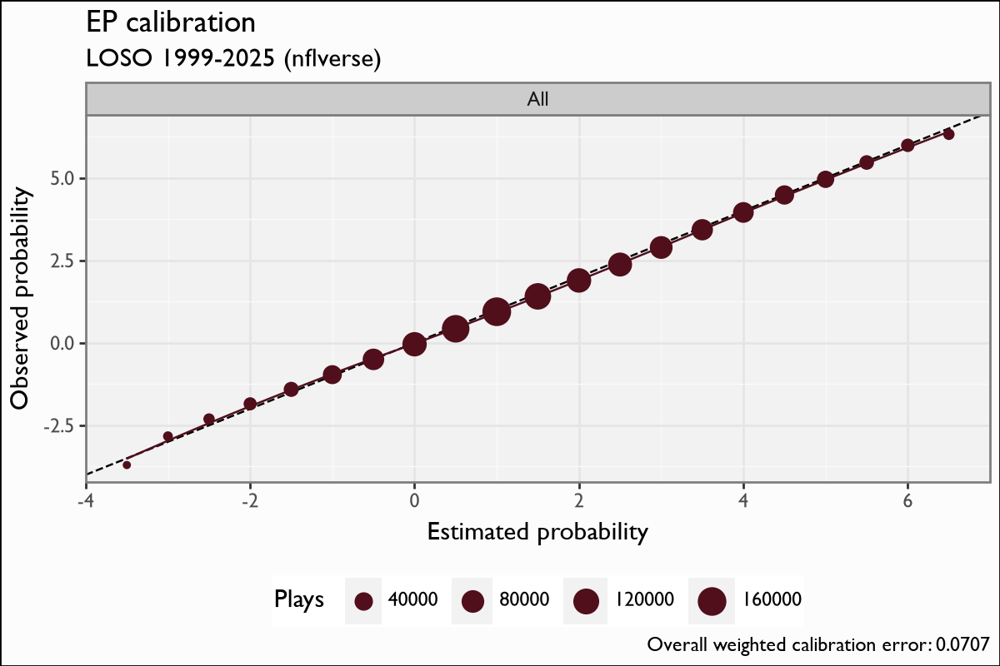
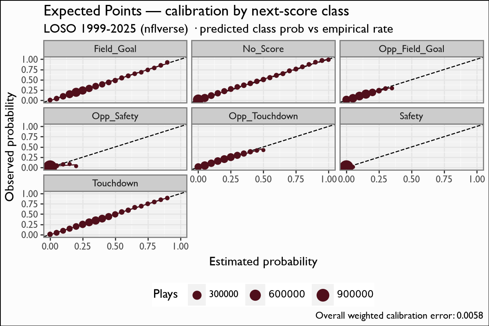
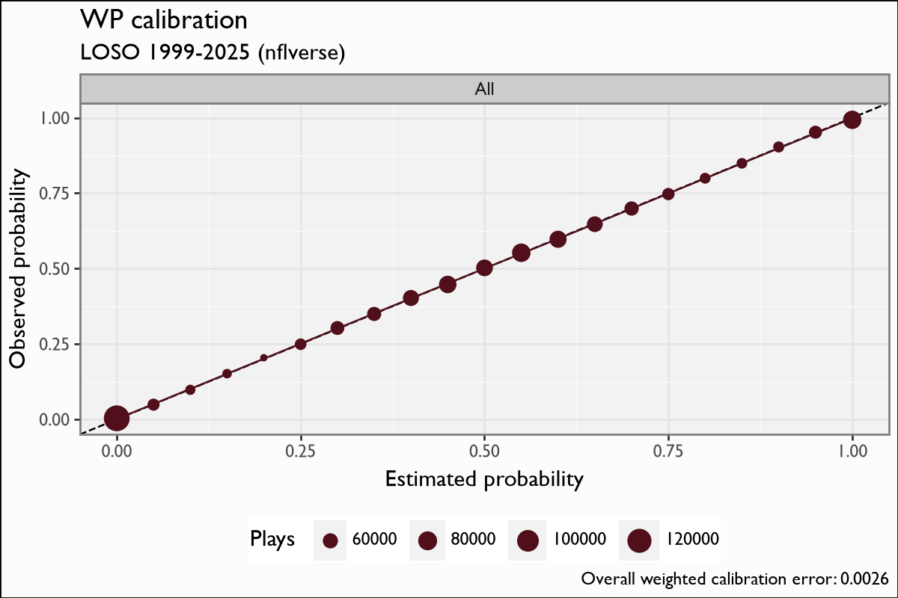
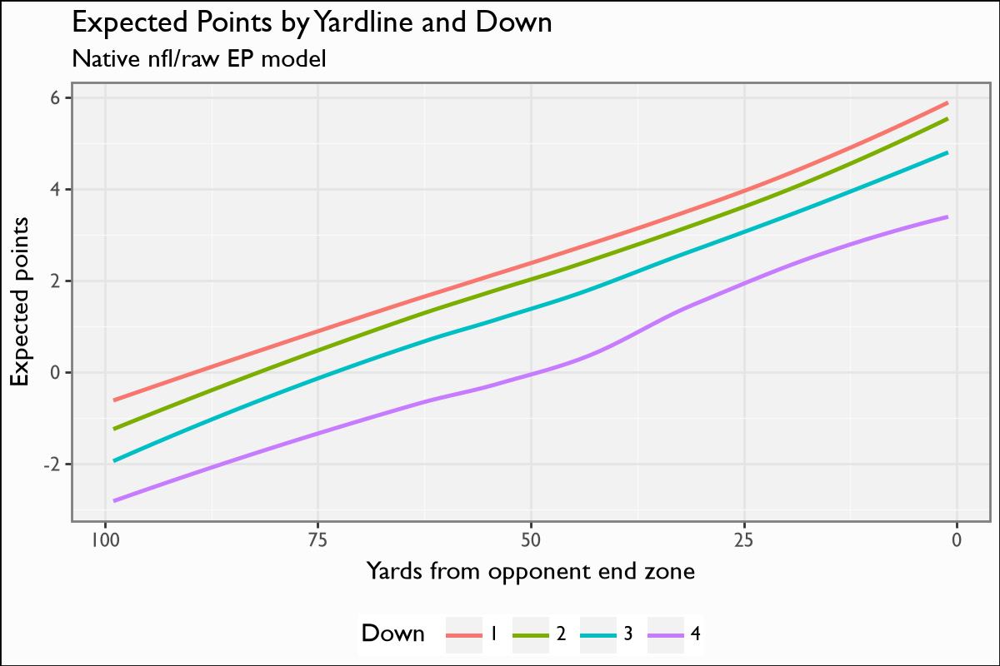

# NFL EP/WP/CP model report — 1999-2025 (nflverse)

Generated 2026-06-24 · LOSO cross-validation · per-fold nrounds=canonical

## Calibration (leave-one-season-out)

| Model | Weighted cal error | Brier | Plays |
|---|---|---|---|
| EP | 0.0707 | — | 1,195,636 |
| WP | 0.0026 | 0.1536 | 1,268,220 |
| CP | 0.0136 | 0.1919 | 339,706 |

CP weighted cal error by air-yards bucket:
  - Deep: 0.0168 (n=61,150)
  - Intermediate: 0.0164 (n=106,632)
  - Short: 0.0107 (n=171,913)

## Figures

- 
- 
- 
- 
- 
- 
