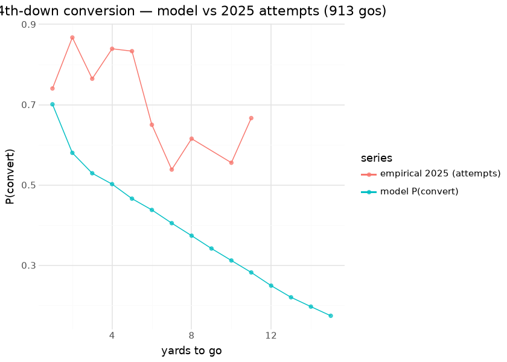

# Fourth-Down Yards (`fd_model`)

The fourth-down yards model predicts the **distribution of yards gained** on a go-for-it (or third-down) attempt — the core of the **nfl4th** decision surface. From the 76-class gain distribution we derive P(first down) for any distance-to-go, then combine it with the EP/WP surfaces to compute the **go / punt / field-goal / two-point** expected-value comparison. It is a faithful Python retrain of nfl4th’s go-for-it model, validated against the converted nflverse artifact.

This document is compiled: the conversion-probability curve is derived from the released booster at render time (summing class probabilities over the distance-to-go), and compared with the latest published season’s **empirical** 4th-down conversion rates.

## Model features

**14 features**; one row per 3rd/4th-down scrimmage play (1999–2025, `qb_kneel==0`, `week<=17`). The label is `yards_gained` clamped to **\[−10, 65\]** and shifted into **76 ordinal classes** (`label = yards_gained + 10`).

| Feature | Type | What it encodes |
|----|----|----|
| `down` | numeric | Current down (3 or 4). |
| `ydstogo` | numeric | Yards to go — the conversion threshold. |
| `yardline_100` | numeric | Field position (compresses the gain distribution near the goal line). |
| `era0`..`era4` | one-hot | Rule-era one-hot (cuts 2001/2005/2013/2017) — era-aware across 1999–2025. |
| `outdoors` / `retractable` / `dome` | binary | Stadium-type one-hots. |
| `posteam_spread` | numeric | Possession-team spread (game-script context). |
| `total_line` | numeric | Game total (pace / offensive-environment proxy). |
| `posteam_total` | numeric | Possession-team implied total. |

## The model

**Algorithm.** XGBoost, `objective=multi:softprob` over **76 classes**, **1,124 rounds**, `eta=0.01`, `max_depth=2`, `gamma=2`, `subsample=0.8`, `colsample_bytree=0.8`, `min_child_weight=0.8` — verbatim from the nfl4th R recipe. P(first down) for any distance-to-go is recovered by summing class probabilities for gains ≥ the distance.

**Evaluation.** Parity against the converted nflverse artifact: **mean-gain correlation 0.9856** (informational — era-aware full-history retrain vs the nfl4th 2014–19 oracle) — see [Parity](parity.md).

## P(convert) vs reality, render time

Teams *choose* which 4th downs to attempt, so the realized curve reflects selection (coaches go when they like the matchup) while the model curve is the unconditional estimate at a fixed neutral state — the gap between them is selection, not error. That distinction is the whole reason the decision layer values options with a model rather than empirical rates.

## The decision surface in use — 2025

The published pbp carries the nfl4th-style decision columns (`go_wp_diff`, `fg_wp_diff`, `punt_wp_diff`) plus `fourth_down_recommendation`.

**Read the `*_wp_diff` columns carefully**: each is that option’s WP *minus the best option’s*, so every one of them is `<= 0` and the recommended option is the one sitting at exactly `0`. A `go_wp_diff > 0` test is therefore always false — it is never satisfied on any play in any season — and a table built on it silently reports “the model never says go” plus an agreement rate that is really just the share of 4th downs teams did not go for. This document made that mistake until 2026-09-01. The unambiguous column is `fourth_down_recommendation`, which matches `go_wp_diff == 0` exactly (2025: 2,004 of 2,004; 2024: 1,860 of 1,860), so it is what the tables below use.

| Decision layer vs coaches — 2025 season |  |
|----|----|
| the model recommends going on ~47% of 4th downs; teams go on ~21% |  |
| check | value |
| 4th downs with a recommendation | 4,290.000 |
| model says GO | 2,004.000 |
| teams actually went | 932.000 |
| went WHEN the model says go | 0.398 |
| went when the model says kick | 0.059 |
| coach–model agreement rate | 0.687 |

&#10;

## Coach-indexed decision calibration, 2021–2025

League-wide agreement hides the thing the decision surface is actually used to argue about, which is that coaches differ. Indexing by the coach on the sideline (from the schedule’s `home_coach` / `away_coach`, assigned to whichever side had the ball) turns one number into a distribution:

| Aggressiveness on 4th down by head coach — 2021–2025 |  |  |  |  |  |  |  |
|----|----|----|----|----|----|----|----|
| top 8 and bottom 8 of 42 coaches with \>=150 decisions; league go-rate when the model says go is 36.4% |  |  |  |  |  |  |  |
|  | Coach | Dec | Model go% | Actual go% | Go when told | Go when told to kick | WP pts left / dec |
|  | Kliff Kingsbury | 270 | 44.4% | 26.7% | 50.0% | 8.0% | 0.296 |
|  | Ben Johnson | 154 | 52.6% | 26.6% | 48.1% | 2.7% | 0.524 |
|  | Dan Campbell | 659 | 51.1% | 28.7% | 47.5% | 9.0% | 0.402 |
|  | Kevin Stefanski | 765 | 39.2% | 23.5% | 46.3% | 8.8% | 0.285 |
|  | Dave Canales | 279 | 49.5% | 25.8% | 43.5% | 8.5% | 0.335 |
|  | Raheem Morris | 261 | 43.7% | 22.6% | 43.0% | 6.8% | 0.396 |
|  | Jonathan Gannon | 370 | 44.9% | 21.6% | 42.2% | 4.9% | 0.306 |
|  | Sean McDermott | 591 | 46.0% | 21.7% | 41.9% | 4.4% | 0.373 |
|  | Kyle Shanahan | 603 | 45.9% | 15.8% | 28.9% | 4.6% | 0.464 |
|  | Mike Tomlin | 707 | 44.1% | 14.6% | 28.8% | 3.3% | 0.522 |
|  | Mike Macdonald | 270 | 37.4% | 11.5% | 28.7% | 1.2% | 0.334 |
|  | Zac Taylor | 649 | 46.1% | 14.6% | 28.4% | 2.9% | 0.522 |
|  | Bill Belichick | 411 | 38.7% | 14.1% | 27.7% | 5.6% | 0.441 |
|  | Dennis Allen | 405 | 41.2% | 14.1% | 27.5% | 4.6% | 0.410 |
|  | DeMeco Ryans | 477 | 36.5% | 13.4% | 27.0% | 5.6% | 0.346 |
|  | Jim Harbaugh | 283 | 41.0% | 14.1% | 25.0% | 6.6% | 0.448 |

&#10;

Three things this makes visible that the league-wide number cannot:

- **The spread is large and it is not noise.** Go-rate-when-the-model-says-go runs from 25% to 50% across coaches — the most aggressive coach in the sample goes twice as often as the most conservative *in the same recommended situations*.
- **Every coach is conservative relative to the model.** Even the top of the table converts only half of the model’s go recommendations. The gap is systematic, not a handful of outliers, which is the honest reading: either coaches price in things the model cannot see (personnel, weather, injury, job security) or the model’s go branch is optimistic. This document cannot separate those two.
- **`model_go_rate` differs by coach too**, which is a *situation* effect, not a tendency one — a coach whose team trails often faces more go-recommended 4th downs. Read `go_when_should` (a rate *within* recommended situations), not `actual_go_rate`, when comparing coaches.

The WP column is deliberately the *per-decision* average rather than a season total, so a coach with 659 decisions is not penalised against one with 154 for merely having coached more games.

## Decision surface

`fd_model` is one input to nfl4th’s 4th-down EV comparison; the others are [`fg_model`](fg.md), [`two_pt_model`](two_pt.md), the [punt distribution](punt.md), and the [nfl4th home-WP](nfl4th_wp.md). Each option’s EV is computed by mapping its outcome distribution through the WP surface and picking the highest-WP action.

## Limitations

The label is recorded `yards_gained`, which can disagree with the official result on penalty/lateral plays — label noise at the tails. The gain window is clipped to \[−10, 65\]. It predicts a *yardage distribution*, not the binary decision; the decision EV is computed downstream.

## Provenance

| field | value |
|----|----|
| `model_type` | fd (fourth-down yards) |
| `objective` | multi:softprob (num_class=76) |
| `features` | 14 (era0..4 + see above) |
| `label` | yards_gained + 10 (clamped −10..65) |
| `training_seasons` | 1999–2025 (182,138 plays) |
| `hyperparameters` | eta=0.01, max_depth=2, nrounds=1124 |
| `lineage` | nfl4th go-for-it model |
| `parity` | mean-gain corr 0.986 (informational; full-history vs nfl4th 2014–19) |
| `distribution` | `nfl_4th_down_models` release (download-on-demand; 76-class model) |
| `rebuild this doc` | `scripts/render_model_docs.sh` (Quarto → GFM; `uv sync --group docs`) |

## Avenues for improvement & open issues

- **Resolved (2026-09-01, PR \#29):** *Coach-level tendencies* — decision calibration is now indexed by head coach (2021–2025, 42 coaches with \>=150 decisions). Go-rate within model-recommended situations spans 25%–50% against a 36% league rate, and every coach in the sample sits below the model.
- **Resolved (2026-09-01, PR \#29):** the decision table’s `go_wp_diff > 0` test was never satisfiable — the `*_wp_diff` columns are differences against the best option, so they are always `<= 0`. It now reads `fourth_down_recommendation`.
- **Whether the residual gap is coaches or the model** is not settled here. Every coach being conservative relative to the surface is equally consistent with coaches pricing in unobservables and with the go branch being optimistic; separating them needs a holdout on realized outcomes, not more slicing.
- **Known issue:** the 76-class yards head shares the xYAC machinery — the multiclass pred_contribs 3-D gotcha applies to any explainability pass.
