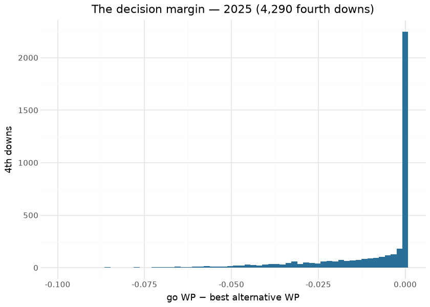

# nfl4th Decision WP (`wp_model`)

The nfl4th decision WP is a **home-perspective** win-probability model
used to value 4th-down options: each candidate outcome
([go](fourth_down.md) / [FG](fg.md) / [punt](punt.md) /
[2-pt](two_pt.md)) is mapped to a resulting game state and scored by
this model, and the highest-WP action is recommended. It is a Python
retrain of the WP model nfl4th applies for 4th-down decisions, validated
against the converted nflverse artifact.

> [!IMPORTANT]
>
> ### This is **not** the core WP suite
>
> The [core WP models](wp_spread.md) are **possession-team** WP (the
> nflfastR `wp` / `vegas_wp` surface). This is nfl4th’s **home-team**
> 11-feature WP, whose contract comes from nfl4th’s decision-WP model.
> The home-perspective transforms are ported verbatim. The two serve
> different layers — don’t cross-wire them.

This document is compiled: the importance table reads the released
booster and the decision-impact section reads the published season’s
decision columns — the surfaces this model’s scores produce — at render
time.

## Model features

**11 features**, home perspective. The label is whether the home team
won.

| Feature | What it encodes |
|----|----|
| `home_receive_2h_ko` | Home team receives the second-half kickoff. |
| `spread_time` | `home_spread · exp(−4 · elapsed_share)` — time-decayed line. |
| `home_posteam` | Home team is on offense. |
| `half_seconds_remaining` / `game_seconds_remaining` | Clock. |
| `Diff_Time_Ratio` | Score differential scaled by time. |
| `home_score_differential` | Home score margin. |
| `home_ep` | Home-perspective expected points (links to the EP model). |
| `ydstogo` | Yards to go. |
| `home_yardline_100` | Home-perspective field position. |
| `home_timeouts_remaining` | Home timeouts left. |

## The model

**Algorithm.** XGBoost, `objective=binary:logistic`, `eta=0.025`,
`max_depth=5`, `gamma=1`, `subsample/colsample=0.8`, **500 rounds** (a
500–2000 sweep all clears 0.99; corr-vs-oracle peaks at 500). Trained
from nfl4th’s win-probability calibration frame (the frozen tuning frame
nfl4th + nflfastR read).

**Evaluation.** Parity P(win) corr **0.9947** (gate ≥0.99) — see
[Parity](parity.md).

## Feature importance

| Features by gain — released nfl4th decision-WP booster |         |
|--------------------------------------------------------|---------|
| feature                                                | gain    |
| home_score_differential                                | 1,050.3 |
| Diff_Time_Ratio                                        | 865.3   |
| spread_time                                            | 333.2   |
| home_posteam                                           | 168.4   |
| home_ep                                                | 117.7   |
| game_seconds_remaining                                 | 62.2    |
| home_yardline_100                                      | 43.2    |
| home_receive_2h_ko                                     | 35.5    |
| home_timeouts_remaining                                | 29.2    |
| half_seconds_remaining                                 | 21.4    |
| ydstogo                                                | 7.2     |

&#10;

## What its scores decide — 2025 season

The published pbp carries the decision layer’s outputs — per-option WP
deltas scored by this model. Their distribution is the model’s footprint
on the season:

| High-leverage GO situations — 2025 |  |
|----|----|
| the classic nfl4th finding: coaches still leave WP on the table in clear-go spots |  |
| check | value |
| 4th downs where GO is worth \> 3 pts of WP | 0.000 |
| of those, teams actually went | 0.000 |
| conversion rate when they went | <na> |

&#10;

## Limitations

It is the **decision-layer** WP, tuned to reproduce nfl4th’s
recommendations, not a general-purpose live WP feed — for that use the
[core WP](wp_spread.md). It inherits the home-perspective framing and
the EP model’s drift through `home_ep`.

## Provenance

| field | value |
|----|----|
| `model_type` | wp (nfl4th home-perspective) |
| `objective` | binary:logistic |
| `features` | 11 (home perspective) |
| `label` | home team won |
| `hyperparameters` | eta=0.025, max_depth=5, nrounds=500 |
| `lineage` | nfl4th decision-WP model |
| `parity` | P(win) corr 0.9947 (gate ≥0.99) |
| `distribution` | `nfl_4th_down_models` release |
| `rebuild this doc` | `scripts/render_model_docs.sh` (Quarto → GFM; `uv sync --group docs`) |

## Avenues for improvement & open issues

- **Unify with the main WP family** — the nfl4th contract keeps a
  separate home-perspective model; folding it into the spread family
  would remove a dual-maintenance surface.
- **Resolved (2026-09-01, PR \#28) — the silent skip:** a missing
  `cal_data.rds` now fails the stage / `train-all` (rc 1) unless
  `--allow-skip` / `--allow-missing-cal-data`, which record
  `status: SKIPPED` with the reason in `models/ledger.jsonl` and
  report.md.
- **Known issue:** the training window (2001-2020) still lags the main
  models; extending it needs the calibration frame rebuilt from current
  `model_pbp` (with `ep` and `Winner`) and the P(win) parity floor
  re-derived — not lowered.
