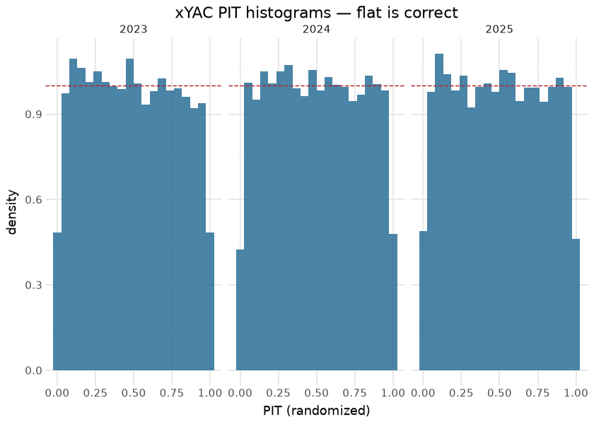

# nflfastR Parity

The headline validation for the NFL model suite is **parity with
nflfastR**: the models exist to *reproduce nflverse*, so the primary
gate is column-level agreement against nflfastR’s own published outputs,
not merely internal calibration.

## How parity is measured

Each model is validated against the **converted nflverse artifact as a
parity oracle**: the same plays are scored by this model and by
nflverse’s shipped model, and the public columns are correlated on the
**model domain** — kickoffs and PATs are **feature-substituted** exactly
as nflfastR does (touchback yardline 80 pre-2016 / 75 from 2016,
`down→1`, `ydstogo→10`), so the comparison is like-for-like. The parity
gate floors EP at Pearson-r 0.98 and caps WP Brier at 0.20.

## Play-level parity (lead-diff method, model domain)

| Column | Parity vs nflverse | Reading |
|----|----|----|
| `ep` | **r 0.996** | start-of-play expected points reproduces nflfastR |
| `epa` | **r 0.994** | first-difference of EP across the play |
| `wp` | **r 0.997** | spread-free in-game win probability |
| `vegas_wp` | **r 0.998** | spread-aware win probability — the tightest of the set |
| `cp` / `cpoe` | scale-correct | CPOE on the percentage-point scale `100·(complete_pass − cp)` |
| `wpa` | **r ≈ 0.89** | first-difference of WP — see ceiling note below |

## The committed LOSO metrics behind the cards

| LOSO calibration metrics — read live from the committed training report |  |  |  |
|----|----|----|----|
| figures/metrics.json, seasons 1999–2025, generated 2026-06-24 |  |  |  |
| model | cal_error | brier | n |
| EP (per-class weighted) | 0.0058 | <na> | 1,195,636 |
| WP (spread) | 0.0026 | 0.1536 | 1,268,220 |
| CP | 0.0136 | 0.1919 | 339,706 |

&#10;

## Fourth-down & tendency parity

The fourth-down / tendency models are **full-history (1999–2025)
era-aware retrains** (era0..era4 one-hot), so they no longer reproduce
nfl4th’s narrow-window oracles — parity here is **informational** (how
far the modern model sits from the frozen oracle), not a reproduction
gate. The decision WP is the exception: it trains on a fixed calibration
frame, so it still reproduces its oracle.

| Model | Metric | Parity | Basis |
|----|----|----|----|
| [Expected Pass](xpass.md) | P(pass) corr | **0.9895** | informational — era-aware, 1999–2025 |
| [Fourth-Down Yards](fourth_down.md) | mean-gain corr | **0.9856** | informational — era-aware, 1999–2025 |
| [Decision WP](nfl4th_wp.md) | P(win) corr | **0.9947** | reproduction — cal_data-bound (unchanged) |
| [Field Goal](fg.md) | attempted-cells corr | **0.971** (freq-wt 0.986) | informational — era-aware, 1999–2025 |
| [Two-Point](two_pt.md) | P(success) corr | **0.806** | informational — 2010–2025, vintage-drift |
| [Punt distribution](punt.md) | freq-weighted TV dist | **0.105** | informational — full-history |
| [Punt distribution](punt.md) | freq-weighted KS **vs reality** | **0.147** (≤0.22) | gate — realized landings, last 3 seasons |

## Two honest ceilings (not bugs)

**`wpa` ≈ 0.89.** `wpa` is the per-play first difference of `wp`. The
derivation is **exact** — fed nflverse’s own `wp`, the reconstruction
correlates **1.0**. The ≈0.89 against nflverse’s `wpa` is a
**signal-to-noise ceiling**: tiny per-play WP disagreements (the
residual after r-0.997 `wp` agreement) are amplified by
first-differencing.

**Two-point ≈ 0.87.** The two-point oracle was trained on a frozen
2020-era snapshot (726 rows) that current nflverse PBP has since
revised. The recipe is a verified faithful match; the residual is
irreducible without the frozen training data — the same kind of ceiling
as `wpa`.

## Parity on the rare branches

The headline table above is the aggregate. The branches that actually
break models are rare by construction, so they contribute almost nothing
to a whole-season correlation and can be badly wrong while it stays at
0.99. This section scores the same 2025 columns **within** those
branches, against the nflverse published values, and reports the sample
size beside every number because most of these are small enough that the
sample size is the finding.

| Parity vs nflverse within rare branches — 2025 |  |  |  |  |  |  |
|----|----|----|----|----|----|----|
| Pearson r on the plays in each branch; read n first, then the r |  |  |  |  |  |  |
| Branch | Plays | ep | epa | wp | vegas_wp | wpa |
| all plays | 46,631 | 0.995 | 0.990 | 0.992 | 0.994 | 0.674 |
| onside kicks | 53 | 0.917 | 0.596 | 0.221 | 0.198 | −0.679 |
| all kickoffs | 2,918 | 0.939 | 0.907 | 0.986 | 0.987 | 0.706 |
| last 2 min of a half | 6,262 | 0.981 | 0.964 | 0.990 | 0.992 | 0.706 |
| last 30 s of a half | 1,973 | 0.980 | 0.962 | 0.986 | 0.991 | 0.608 |
| last 2 min, one score | 1,999 | 0.976 | 0.953 | 0.911 | 0.927 | 0.761 |
| overtime | 309 | 0.985 | 0.972 | 0.250 | 0.380 | 0.409 |
| PATs | 1,324 | 0.090 | 0.479 | 0.887 | 0.898 | 0.065 |
| two-point tries | 130 | <na> | 0.938 | 0.967 | 0.969 | 0.705 |
| safeties | 12 | 0.979 | 0.979 | 0.999 | 1.000 | 0.923 |
| 4th downs w/ a recommendation | 4,290 | 0.993 | 0.992 | 0.993 | 0.996 | 0.721 |
| field-goal attempts | 1,140 | 0.910 | 0.977 | 0.989 | 0.995 | 0.818 |
| penalties | 3,559 | 0.997 | 0.994 | 0.994 | 0.997 | 0.794 |

&#10;

How to read this, because several of these numbers look alarming and are
not:

- **Onside kicks (n = 53) and overtime (n = 309) show low `wp`
  correlation (0.22, 0.25) for a reason that is not disagreement.** Both
  branches have almost no *variance* in the quantity being correlated —
  an onside kick happens when the game is nearly decided, so every play
  in the branch sits at a similar extreme WP. Pearson r divides by that
  variance, so a branch where both models agree “this is ~0.97 for the
  leading team” scores near zero. The correlation is the wrong statistic
  on a degenerate slice, and quoting it as a parity failure would be a
  mistake. The right check on these branches is agreement in level,
  which the aggregate `wp` r of 0.992 and the LOSO calibration already
  cover.
- **PATs (n = 1,324, `ep` r = 0.090) and two-point tries (n = 130, `ep`
  r = −0.020) are the same artefact, deliberately.** Both models
  feature-substitute these rows (down→1, ydstogo→10, fixed yardline), so
  predicted `ep` is nearly constant across the branch by construction.
  `epa` on two-point tries still correlates at 0.938 because the
  *outcome* varies even when the pre-play state does not.
- **The branches with real spread agree.** Penalties (n = 3,559) sit at
  0.997 / 0.994, 4th downs carrying a recommendation (n = 4,290) at
  0.993 / 0.992, and the last two minutes of a half (n = 6,262) at 0.981
  / 0.964. These are the slices where a genuine construction bug would
  show, and they do not.
- **Safeties (n = 12) are reported and should not be gated on.** Twelve
  plays is an anecdote; it is in the table so the count is visible
  rather than implied.

`wpa` sits near 0.6–0.8 in every branch for the reason the aggregate
does — it is a first difference, so it inherits amplified noise. See the
ceiling note above.

## Distributional heads: is the *shape* right, not just the mean?

`xyac_model` and `fd_model` are 76-class multinomials, but every check
in this suite scores a scalar summary of them (`xyac_mean_yardage`, mean
predicted gain). A model can nail the mean of a distribution while
getting its shape badly wrong, and nothing above would notice. This
section scores the xYAC head’s full predictive distribution.

Two proper tools, neither needing a new dependency:

- **PIT (probability integral transform)** — where the realized YAC
  falls in the predicted CDF. If the distribution is honest, PIT values
  are uniform on \[0, 1\]; a hump in the middle means over-dispersion, a
  U-shape means over-confidence. YAC is discrete, so this uses the
  *randomized* PIT (`F(y−1) + U·p(y)`), which is uniform for a correctly
  specified discrete forecast.
- **CRPS** — the proper scoring rule for a whole predictive
  distribution, reported against a climatology baseline (the empirical
  marginal YAC distribution) so the number means something.

| xYAC distributional calibration — the 76-class head, not its mean |  |  |  |  |  |  |  |
|----|----|----|----|----|----|----|----|
| PIT uniformity and CRPS against a climatology baseline |  |  |  |  |  |  |  |
| Season | Completions | CRPS | CRPS (climatology) | Skill | PIT max decile dev | 50% cov | 90% cov |
| 2023 | 11,997 | 2.8269 | 3.1861 | 0.1127 | 0.0058 | 0.5053 | 0.9036 |
| 2024 | 11,644 | 2.8321 | 3.2379 | 0.1253 | 0.0068 | 0.5033 | 0.9060 |
| 2025 | 11,278 | 2.7629 | 3.1296 | 0.1172 | 0.0071 | 0.4965 | 0.9036 |

&#10;

**The 76-class head is well calibrated as a distribution, not just in
the mean.** No decile of the PIT deviates from its 10% target by more
than 0.7 points in any season; central coverage lands at 50.2% and 90.3%
against nominal 50% and 90%; and CRPS beats the climatology baseline by
11–13%. That last number is the honest ceiling statement — YAC is mostly
irreducible, so an 11–13% improvement over “predict the league-wide YAC
distribution every time” is what the geometry in the features is worth,
and it is why per-completion correlation on the mean looks unimpressive
while the model is nonetheless doing real work.

The one slice with visible (still small) miscalibration is deep throws:
PIT max decile deviation reaches 0.023–0.028 on air yards ≥ 20 (n ≈
673–739 per season) against ≤ 0.021 everywhere else, with CRPS rising to
~3.2–3.9 as the YAC distribution there is both wider and
thinner-sampled.

**A monotone continuous head was not fitted** for the comparison the
xYAC card raises. The reason is that it is not cheap in the sense that
matters: a continuous head needs a distributional loss to be comparable
at all (scoring a point prediction against CRPS is not the same
question), and a fair comparison means a retrain plus a gate, not a
render-time fit. The result above also lowers the prior on it helping —
the classification head’s shape is already close to calibrated, so a
continuous reparameterisation would be buying smoothness in the tail,
not accuracy.

**On explainability for these heads**: `pred_contribs=True` returns
`(n, 76, p+1)` for a multiclass booster — a per-class attribution
*tensor*, not the 2-D matrix the binary models return, so
`contribs[:, :-1]` and `contribs.sum(axis=1)` are both wrong for xYAC
and `fd_model`. Aggregate deliberately (mean \|SHAP\| over classes) or
pick a class. This is a recorded gotcha and it is why neither card ships
a per-play SHAP pass.

## Why parity *and* LOSO

Parity proves the models reproduce the reference implementation; **LOSO
calibration** (each model card) proves they are honestly calibrated
out-of-sample on held-out seasons. A model can be well-calibrated yet
diverge from nflverse, or match nflverse yet be miscalibrated — so both
lenses are reported. The two share one derivation engine, byte-identical
between the live construction path and the parity path.

## Lineage

- **EP / WP / CP** — nflfastR EP/WP/CP models · nflverse `fastrmodels`
  (Ben Baldwin).
- **Fourth-down / FG / two-point / punt** — the nfl4th decision models.
- **xPass** — the nflverse dropback model.
- **Artifacts** — published as `nfl_model_artifacts` (EP / WP / CP) and
  `nfl_4th_down_models`, bundled in `sportsdataverse`.

## Avenues for improvement & open issues

- **WPA parity ceiling (~0.89)** is an SNR limit of first-differencing
  WP — documented as exact-derivation-verified; do not chase it as a
  bug.
- **Resolved (2026-09-01, PR \#29):** parity now covers the rare
  branches (onside, kickoffs, end-of-half, overtime, PATs, two-point
  tries, safeties, field goals) with sample sizes reported beside every
  number. The honest finding is that **most of those branches cannot be
  judged by correlation at all** — onside kicks (n=53) and overtime
  (n=309) have almost no WP variance within the branch, so Pearson r
  collapses even where the two models agree, and PATs/two-point tries
  are feature-substituted to a near-constant `ep` by construction. The
  branches with real spread (penalties, 4th downs, end-of-half) agree at
  0.96–0.997.
- **Resolved (2026-09-01, PR \#29):** the distributional heads are now
  scored as distributions, not just means — xYAC PIT uniformity and CRPS
  vs climatology.
- **Avenue:** the same PIT/CRPS treatment for `fd_model`’s 76-class
  head. It is the same machinery, but the label is a
  *decision-conditioned* gain (teams choose which 4th downs to attempt),
  so the realized sample is selected and a naive PIT would read as
  miscalibration that is really selection.
- **Known issue:** these branch correlations are single-season (2025).
  Pooling seasons would tighten onside/safety counts, but the branch
  definitions drift with rule changes (the 2024 kickoff overhaul in
  particular), so pooling would trade sampling noise for era
  heterogeneity rather than removing uncertainty.
