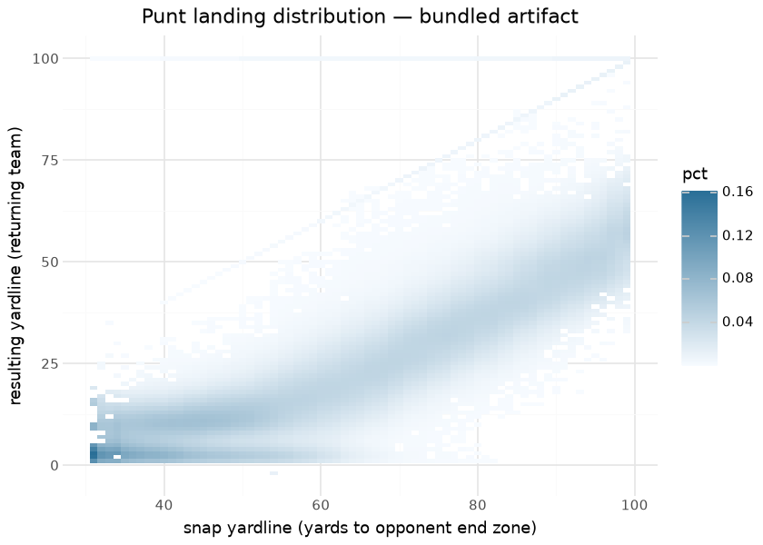
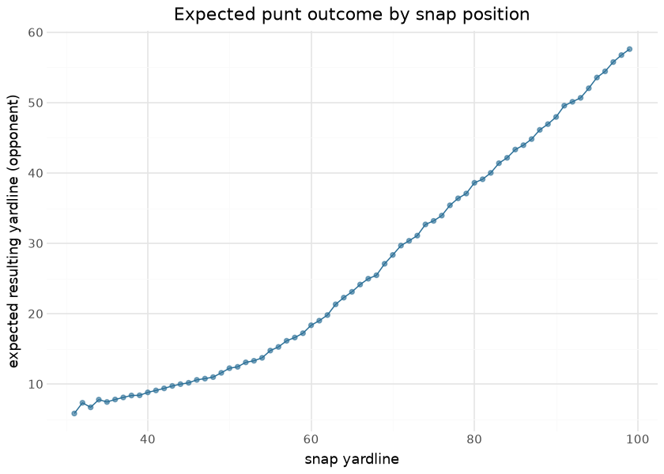

# Punt Outcome Distribution (`punt_data`)

The punt surface is an **empirical landing distribution** — *not* a
trained model — giving, for each pre-punt field position, the
distribution of resulting field positions (plus block / return-TD / muff
probabilities). It powers the **punt branch** of the [nfl4th
decision](fourth_down.md): the post-punt field position distribution is
mapped through the WP surface to value punting. It is a Python builder
reproducing nfl4th’s punt distribution, validated against the converted
nflverse distribution.

This document is compiled: the surface below is plotted from the bundled
`punt_data.parquet` artifact at render time, and the expected-net
section holds its implied net punt distance against the latest published
season’s actual punts.

## How it is built

From PBP punts: per punt,
`yardline_after = yardline_100 − kick_distance + return_yards` (end-zone
→ 20; blocked → `yardline_100`; capped to \[1, 100\]). Flags: `blocked`,
`return_td (= yardline_after == 100)`,
`muff (= fumble_lost, 0 if blocked)`. Then, **grouped by
`yardline_100`** (and filtered to `yardline_100 > 30`):

1.  coarse-bin the muffed / blocked / return-TD percentages;
2.  a 2-D KDE (`scipy.stats.gaussian_kde`) over
    `(yardline_100, yardline_after)` excluding blocked + return-TD rows,
    normalized per snap yardline;
3.  re-insert block (`yardline_after = 999 → yardline_100`) and TD
    (`= 100`) rows rescaled by `1 − (block + td)`;
4.  duplicate rows for `muff ∈ {0, 1}` weighted by the bin muff rate;
    renormalize.

Output columns: `yardline_100`, `yardline_after`, `pct`, `muff`.

## The surface

## Evaluation

Distributional parity against the converted nflverse distribution via
**total-variation (TV) distance** per snap yardline (KDE bandwidth
causes small, expected divergence): **freq-weighted TV 0.0652** (gate
≤0.10), mean TV 0.0944, median 0.0599. See [Parity](parity.md).

A render-time reality check against the latest published season’s punts
— mean realized net (kick distance minus return) vs the surface’s
expectation over the same snap positions:

| Render-time punt-surface check — 2025 season snap mix |          |
|-------------------------------------------------------|----------|
| check                                                 | value    |
| 2025 punts (snap \> 30)                               | 2,031.00 |
| surface-expected resulting yardline (2025 snap mix)   | 25.05    |

&#10;

## Limitations

It is a **league-average empirical surface** — no punter identity, hang
time, or coverage. KDE smoothing slightly blurs the per-yardline landing
spread (the TV residual). Snap positions inside the 30 are excluded
(where a punt is rarely the decision).

## Provenance

| field | value |
|----|----|
| `model_type` | punt_data (empirical distribution, not a model) |
| `columns` | yardline_100, yardline_after, pct, muff |
| `build` | 2-D Gaussian KDE over punt landings, per snap yardline |
| `lineage` | nfl4th punt model |
| `parity` | freq-weighted TV 0.105 (informational; full-history vs nfl4th 2010–19) |
| `distribution` | bundled in sportsdataverse (`punt_data.parquet`) |
| `rebuild this doc` | `scripts/render_model_docs.sh` (Quarto → GFM; `uv sync --group docs`) |

## Avenues for improvement & open issues

- **Returner identity and directional punting** are absent.
- **Known issue:** as a distribution artifact it has no gate of its own
  — errors surface only through the 4th-down decision calibration.
