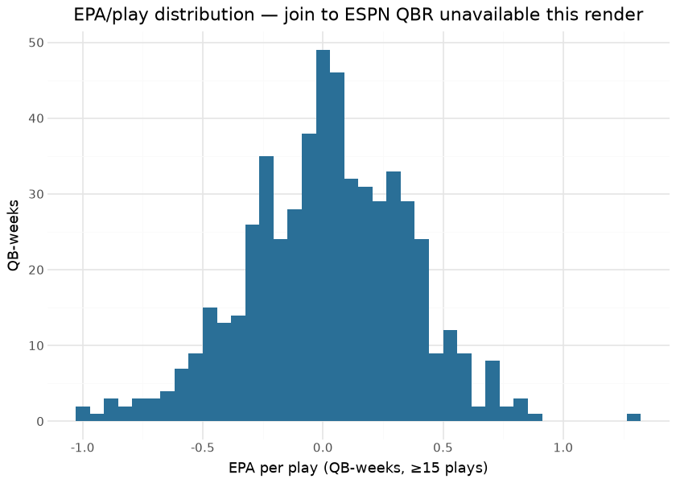

# QBR

The QBR model reconstructs an **ESPN-Total-QBR-style 0–100 quarterback
rating** from EPA components, so a QBR can be produced for any game in
the corpus without an ESPN QBR feed. It is a per-(quarterback, game)
regression onto ESPN’s published raw QBR, sitting one layer above the
[EP model](ep.md) — its inputs are EPA aggregates, and EPA is the first
difference of EP.

This document is compiled: the target-analysis sections below read
ESPN’s published QBR (the `nfl_espn_qbr` release this repo also
publishes) and the per-QB EPA aggregates from the published pbp at
render time — quantifying exactly how much of ESPN’s number the EPA
components can explain, which is the quantity the model reconstructs.

## Model features

**6 features**, one row per (quarterback, game). Each EPA component is
the per-game **win-probability-leverage-weighted** mean of that
component over the QB’s plays (high-leverage plays weighted up, garbage
time weighted down), and EPA is clamped to protect the regression from
blow-up plays (`EPA < −5 → −5`, fumble → −3.5).

| Feature | Type | What it encodes |
|----|----|----|
| `qbr_epa` | numeric | Total QBR-attributable (clamped, leverage-weighted) EPA — the dominant driver. |
| `pass_epa` | numeric | EPA on dropbacks. |
| `rush_epa` | numeric | EPA on QB rushes. |
| `sack_epa` | numeric | EPA lost on non-fumble sacks. |
| `pen_epa` | numeric | EPA from penalties on the QB’s plays. |
| `spread` | numeric | Possession-team pregame spread (garbage-time / leverage context). |

## The model

**Algorithm.** XGBoost regression (`objective=reg:squarederror`). The
target is ESPN’s *published raw QBR* for the quarterback-game; the EPA
components come from the [EP model](ep.md), so QBR composes on top of
EP/EPA. The leverage weighting mirrors ESPN’s clutch emphasis (plays in
0.1–0.2 / 0.8–0.9 home-WP bands carry 0.9× weight, beyond that 0.6×).

**Evaluation.** As a continuous bounded (0–100) target, QBR is checked
by predicted-vs-ESPN scatter rather than a probability-calibration plot.
The render-time analysis below measures the EPA-explainability ceiling
directly.

## The target, and its EPA-explainability

| The published nfl_espn_qbr target — render time |           |
|-------------------------------------------------|-----------|
| check                                           | value     |
| ESPN QBR quarterback-weeks (release)            | 10,742.00 |
| latest season rows                              | 566.00    |
| mean QBR (latest season)                        | 52.57     |

&#10;

The unweighted EPA/play already explains most of QBR’s variance; the
model’s leverage weighting, clamping, and component split close much of
the remaining gap. What can never close is ESPN’s charting-based credit
assignment — inputs the public feed does not carry.

## Results — 2025 QBR leaders

| ESPN Total QBR leaders — latest season (min 8 games)  |      |       |
|-------------------------------------------------------|------|-------|
| the published target the reconstruction is trained on |      |       |
| quarterback                                           | qbr  | games |
| J. Love                                               | 72.7 | 15    |
| D. Prescott                                           | 69.1 | 16    |
| D. Maye                                               | 68.1 | 21    |
| P. Mahomes                                            | 66.5 | 14    |
| M. Stafford                                           | 66.4 | 20    |
| B. Purdy                                              | 65.4 | 11    |
| D. Jones                                              | 64.4 | 12    |
| M. Jones                                              | 64.0 | 8     |
| J. Allen                                              | 62.3 | 18    |
| B. Mayfield                                           | 59.7 | 17    |

&#10;

## Limitations

QBR is a **bounded 0–100** target, so the model cannot perfectly
reproduce ESPN’s proprietary formula (clutch weighting and charting
inputs we do not have). Treat the output as a faithful reconstruction of
the **EPA-explainable** part of QBR, not a byte-exact ESPN replica. It
inherits the EP model’s drift through the EPA components.

## Provenance

| field | value |
|----|----|
| `model_type` | qbr |
| `objective` | reg:squarederror |
| `features` | qbr_epa, pass_epa, rush_epa, sack_epa, pen_epa, spread |
| `target` | ESPN raw Total QBR (per quarterback-game; `nfl_espn_qbr` release) |
| `lineage` | ESPN Total QBR · EPA components from the EP model |
| `distribution` | bundled in sportsdataverse (`qbr_model.ubj`) |
| `rebuild this doc` | `scripts/render_model_docs.sh` (Quarto → GFM; `uv sync --group docs`) |

## Avenues for improvement & open issues

- **Opponent adjustment** — the QBR-style rating is unadjusted for
  defense faced.
- **Known issue:** the registry’s qbr row remains an external TODO
  (trainer not in `model_training/`) — this report documents the bundled
  artifact, not an in-repo recipe.
