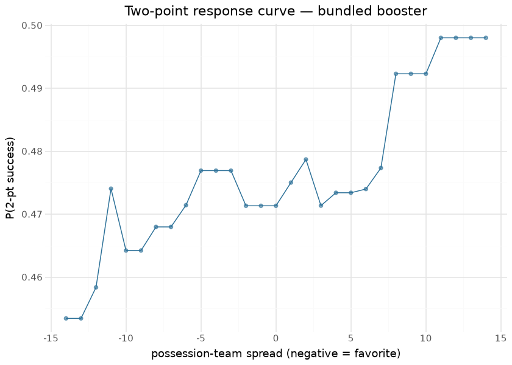

# Two-Point Conversion (`two_pt_model`)

The two-point-conversion model estimates the probability a two-point
attempt **succeeds**, given game context. It powers the **go-for-2
vs. extra-point** branch of the [nfl4th decision](fourth_down.md): the
success probability times two points is compared against the extra-point
EV. It is a Python retrain of nfl4th’s 2-pt model, validated against the
converted nflverse artifact.

This document is compiled: the response-curve and season sections score
the bundled booster at render time and compare against the latest
published season’s empirical conversion rate.

## Model features

**9 features**; one row per two-point attempt (`yardline_100==2`,
2010–2025). The binary label is `two_point_conv_result=='success'`. A
**monotone constraint** `(0,0,0,0,0,0,1,0,1)` forces success probability
to rise with `posteam_spread` and `posteam_total`.

| Feature | Type | What it encodes |
|----|----|----|
| `era2` / `era3` / `era4` | one-hot | Rule era (2006–13 / 2014–17 / ≥2018). |
| `outdoors` / `retractable` / `dome` | binary | Stadium-type one-hots. |
| `posteam_spread` | numeric | Possession-team spread (team-strength proxy; **monotone ↑**). |
| `total_line` | numeric | Game total. |
| `posteam_total` | numeric | Possession-team implied total (offense quality; **monotone ↑**). |

## The model

**Algorithm.** XGBoost, `objective=binary:logistic`, **21 rounds**,
`eta=0.0576`, `max_depth=8`, with the monotone constraint above —
verbatim from the nfl4th R recipe. A deliberately shallow fit for a
small target.

**Evaluation.** Parity P(success) corr **0.8718** — **below** the 0.99
gate, and honestly so: the residual is **training-data vintage drift**,
not a recipe error.

> [!NOTE]
>
> ### Why parity is capped at ~0.87 (not a bug)
>
> The oracle was trained on the **2020-era nflfastR-data RDS** (726
> rows, 21 rounds); current nflverse PBP has since revised those same
> plays (spread/total backfills, a few changed 2-pt results). The recipe
> — features, params, monotone constraints, filters — is a **verified
> faithful match**; the residual is irreducible without the frozen
> training snapshot, analogous to the [`wpa` SNR ceiling](parity.md).

## The response curve, render time

| Render-time two-point evaluation — 2025 |  |
|----|----|
| the model's whole dynamic range is a few points around the base rate — by design for a 1,363-attempt target |  |
| check | value |
| 2025 two-point attempts | 130.0000 |
| empirical success rate | 0.4615 |
| model range over the spread grid (min) | 0.4534 |
| model range (max) | 0.4980 |

&#10;

## Limitations

The sample is tiny, so the model is near-constant — treat it as a
slightly-context-adjusted base rate, not a sharp per-play estimate. No
play-call, personnel, or defensive context. The decision it feeds is
driven mostly by the ~48% success level against the empirical XP make
rate.

## Provenance

| field | value |
|----|----|
| `model_type` | two_pt |
| `objective` | binary:logistic (monotone spread/total ↑) |
| `features` | 9 (see above) |
| `label` | two_point_conv_result == success |
| `training_seasons` | 2010–2025 (1,363 attempts) |
| `hyperparameters` | eta=0.0576, max_depth=8, nrounds=21 |
| `lineage` | nfl4th two-point model |
| `parity` | P(success) corr 0.806 (informational; 2010–2025, vintage-drift) |
| `distribution` | bundled in sportsdataverse |
| `rebuild this doc` | `scripts/render_model_docs.sh` (Quarto → GFM; `uv sync --group docs`) |

## Avenues for improvement & open issues

- **Sparse-sample ceiling** — a documented soft gate (~0.87 parity)
  because the data vintage is thin; pooling college two-point data is a
  plausible transfer-learning experiment.
- **Resolved (2026-09-01, PR \#28):** `_stage.gate_status()` labels the
  soft gate `SOFT PASS` / `SOFT FAIL` in the console,
  `models/ledger.jsonl`, report.md and the train-all summary, so it can
  never read as a hard-gate `PASS`; the 0.99 floor is unchanged.
