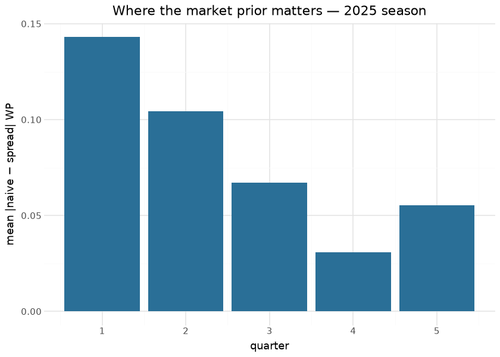

# Win Probability — naive (`wp`)

The naive Win Probability model answers *given only the game state, with
no betting-market information, how likely is the possession team to
win?* It is the spread model’s sibling — identical except it **drops
`spread_time`** — and is the nflfastR `wp` surface: the right choice
when a pregame spread is unavailable or when you explicitly want a
market-free WP.

This document is compiled: the naive-vs-spread divergence analysis below
is recomputed at render time from the latest published `nfl_model_pbp`
season, which carries both surfaces on every play.

## Model features

**11 features** — exactly the [spread model](wp_spread.md)’s set **minus
`spread_time`**: `receive_2h_ko`, `home`, `half_seconds_remaining`,
`game_seconds_remaining`, `Diff_Time_Ratio`, `score_differential`,
`down`, `ydstogo`, `yardline_100`, `posteam_timeouts_remaining`,
`defteam_timeouts_remaining`. Dropping the single market feature is the
*only* difference between the two WP heads, which is why they can be
compared head-to-head.

## The model

**Algorithm.** XGBoost, `objective=binary:logistic`, `eta=0.2`,
`max_depth=4` — the `fastrmodels` naive-WP recipe. Trained on the **full
1999–2025 history (1,268,220 plays)**, the same frame as the spread
model. The higher learning rate / shallower trees reflect that, without
the spread, there is less structured signal to fit.

**Evaluation.** nflfastR parity: `wp` correlates **r 0.997** against
nflverse (see [Parity](parity.md)). LOSO calibration uses the same
protocol as the spread model.

## Feature importance

| Features by gain — committed naive-WP booster |         |
|-----------------------------------------------|---------|
| feature                                       | gain    |
| score_differential                            | 3,206.4 |
| Diff_Time_Ratio                               | 2,884.8 |
| home                                          | 798.8   |
| yardline_100                                  | 225.3   |
| receive_2h_ko                                 | 179.8   |
| game_seconds_remaining                        | 169.8   |
| down                                          | 158.2   |
| posteam_timeouts_remaining                    | 99.3    |
| ydstogo                                       | 69.1    |
| half_seconds_remaining                        | 66.6    |
| defteam_timeouts_remaining                    | 50.8    |

&#10;

Without the market prior, `score_differential`, `yardline_100` and the
clock terms carry the model from the opening kickoff — precisely why the
naive WP is least confident (closest to 0.5) early and diverges most
from the spread WP in the first quarter.

## Naive vs spread — the divergence, measured

The published season carries both surfaces on every play, so the
documented claim — *the two diverge most early and converge as
`spread_time` decays* — is directly measurable:

| Naive-vs-spread divergence — render-time, 2025 |        |
|------------------------------------------------|--------|
| check                                          | value  |
| Q1 mean \|naive − spread\|                     | 0.1431 |
| Q4 mean \|naive − spread\|                     | 0.0310 |
| corr(naive, spread), all plays                 | 0.9275 |

&#10;

## Limitations

Because it ignores the market, the naive model is *less sharp* early in
games: strictly less information than the spread model, so its log-loss
and Brier are worse. Use it only when you want a spread-free WP or lack
a spread; for forecast accuracy when a spread exists, prefer the [spread
model](wp_spread.md). WPA carries the same per-play noise caveat.

## Provenance

| field | value |
|----|----|
| `model_type` | wp_naive |
| `objective` | binary:logistic |
| `features` | 11 (spread set minus `spread_time`) |
| `label` | label (possession team wins) |
| `training_seasons` | 1999–2025 |
| `n_training_rows` | 1,268,220 |
| `hyperparameters` | eta=0.2, max_depth=4 |
| `lineage` | nflfastR naive-WP model · nflverse `fastrmodels` (Ben Baldwin) |
| `parity` | `wp` r 0.997 |
| `artifact` | `models/wp_naive.ubj` (committed; also on `nfl_model_artifacts`) |
| `rebuild this doc` | `scripts/render_model_docs.sh` (Quarto → GFM; `uv sync --group docs`) |

## Avenues for improvement & open issues

- Primarily a fallback when no market prior exists; improvement effort
  belongs in the spread model. **Known issue:** naive WP is
  systematically miscalibrated for large early leads relative to the
  spread model — the quarter-divergence figure above is the standing
  measurement of that delta.
