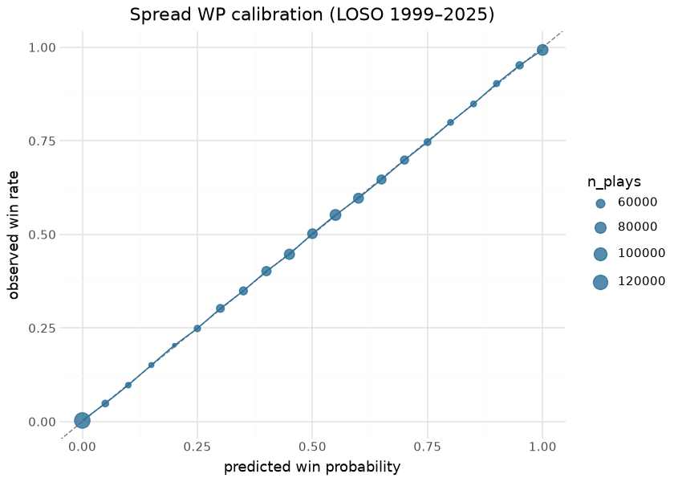
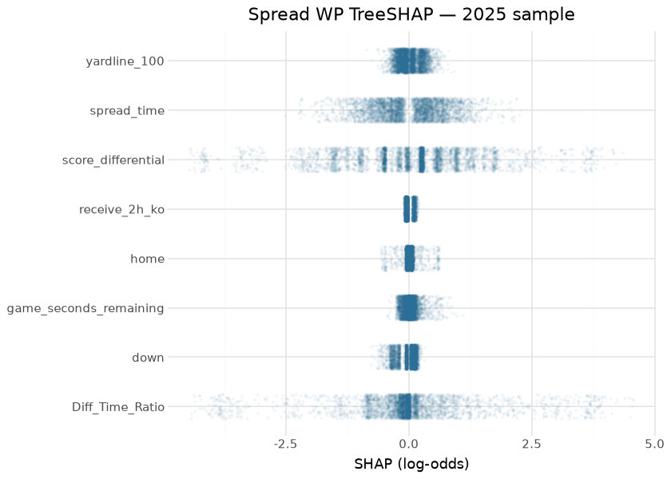
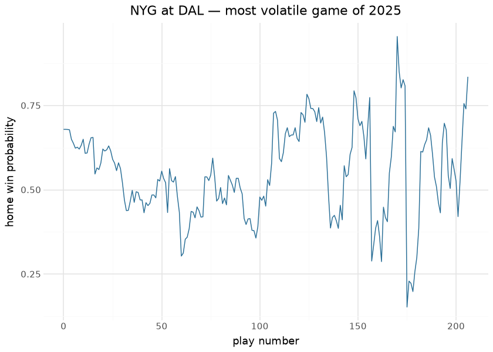

# Win Probability — spread (`vegas_wp`)

The spread-aware Win Probability model estimates the probability that
the team in possession wins the game, given game state **and the pregame
point spread**. It produces the nflfastR `vegas_wp` surface;
consecutive-play differences define **Win Probability Added (WPA)**. It
is a faithful re-implementation of the nflfastR spread WP model
(nflverse `fastrmodels`, Ben Baldwin).

This document is compiled: the LOSO calibration re-plots from the
committed report artifact, and the SHAP/results sections score the
committed booster (`models/wp_spread.ubj`) over the latest published
`nfl_model_pbp` season at render time.

## Model features

**12 features**, all start-of-play. The binary label is
`label = (possession team == game winner)`. The signature feature is the
time-decayed spread.

| Feature | Type | What it encodes |
|----|----|----|
| `spread_time` | numeric | `pos_team_spread · exp(−4 · elapsed_share)` — the pregame spread decayed toward 0 as the clock runs; its influence vanishes by Q4. **The market signal.** |
| `receive_2h_ko` | binary | Possession team receives the second-half kickoff — a known WP edge. |
| `home` | binary | Home-field indicator for the possession team. |
| `half_seconds_remaining` | numeric | Seconds remaining in the half. |
| `game_seconds_remaining` | numeric | Seconds remaining in the game. |
| `Diff_Time_Ratio` | numeric | Score differential scaled by time — an urgency/leverage interaction. |
| `score_differential` | numeric | Possession-team score differential. |
| `down` | numeric | Current down. |
| `ydstogo` | numeric | Yards to go. |
| `yardline_100` | numeric | Field position. |
| `posteam_timeouts_remaining` | numeric | Possession-team timeouts left. |
| `defteam_timeouts_remaining` | numeric | Defense timeouts left. |

## The model

**Algorithm.** XGBoost, `objective=binary:logistic`,
`eval_metric=logloss`, `eta=0.05`, `max_depth=5` — the `fastrmodels`
spread-WP recipe. Trained on the **full 1999–2025 history (1,268,220
plays)**. The `spread_time` decay constant (−4) matches the shipped
derivation.

**Evaluation.** nflfastR parity is the headline gate — `vegas_wp`
correlates **r 0.998** against nflverse, the tightest agreement in the
suite (see [Parity](parity.md)). LOSO calibration below.

## Calibration Results

Leave-one-season-out, pooled out-of-fold, binned predicted WP vs
observed win rate. On the **1999–2025** LOSO pool (1,268,220 plays):
weighted calibration error **0.0026**, Brier **0.154**.

| Frozen LOSO metrics (training report) |                |
|---------------------------------------|----------------|
| metric                                | value          |
| weighted calibration error            | 0.0026         |
| Brier                                 | 0.1536         |
| LOSO plays                            | 1,268,220.0000 |

&#10;

## Feature importance & SHAP

| Features by gain — committed spread-WP booster |         |
|------------------------------------------------|---------|
| feature                                        | gain    |
| score_differential                             | 2,414.4 |
| Diff_Time_Ratio                                | 910.2   |
| spread_time                                    | 495.0   |
| home                                           | 244.9   |
| defteam_timeouts_remaining                     | 128.6   |
| yardline_100                                   | 90.7    |
| posteam_timeouts_remaining                     | 81.6    |
| down                                           | 63.6    |
| game_seconds_remaining                         | 61.1    |
| receive_2h_ko                                  | 50.6    |
| half_seconds_remaining                         | 26.3    |
| ydstogo                                        | 14.4    |

&#10;

`spread_time` and the time/score-differential terms carry the model
early in games; as `spread_time` decays, `score_differential`,
`yardline_100` and the clock terms take over — the intended hand-off
from market prior to live game state, visible in the attribution spread
above.

## Results — the surface in use

| Published-surface sanity — 2025        |            |
|----------------------------------------|------------|
| render-time check                      | value      |
| 2025 plays with vegas_wp               | 45,862.000 |
| mean vegas_wp (possession perspective) | 0.504      |

&#10;

## Limitations

WPA — the first difference of WP — is intrinsically noisy: small
per-play WP movements are dominated by model variance, so single-play
WPA is a directional signal, not a precise quantity (the `wpa` parity
ceiling of ≈0.89 is exactly this — see [Parity](parity.md)). The spread
input is a pregame number; the model does not re-estimate a live spread.
Overtime and end-of-half edge cases are handled by the construction
pipeline upstream, not the model head.

## Provenance

| field | value |
|----|----|
| `model_type` | wp_spread |
| `objective` | binary:logistic |
| `features` | 12 (see above) |
| `label` | label (possession team wins) |
| `training_seasons` | 1999–2025 |
| `n_training_rows` | 1,268,220 |
| `hyperparameters` | eta=0.05, max_depth=5 |
| `lineage` | nflfastR spread-WP model · nflverse `fastrmodels` (Ben Baldwin) |
| `parity` | `vegas_wp` r 0.998 · `wpa` r ≈0.89 (SNR ceiling) |
| `artifact` | `models/wp_spread.ubj` (committed; also on `nfl_model_artifacts`) |
| `rebuild this doc` | `scripts/render_model_docs.sh` (Quarto → GFM; `uv sync --group docs`) |

## Avenues for improvement & open issues

- **Line movement** — the model sees a static spread; closing-line or
  in-week movement would sharpen early-game WP.
- **Known issue:** `spread_time`’s decay exponent (-4.0) is a fitted
  constant frozen in model_vars — it must travel with any retrain.
