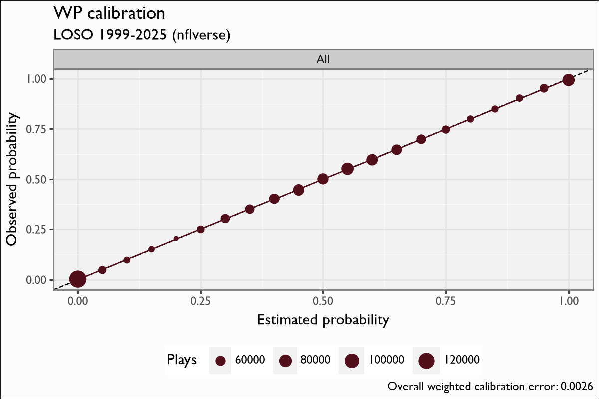

# Win Probability — spread (`vegas_wp`)

## Overview

The spread-aware Win Probability model estimates the probability that the team in
possession wins the game, given game state **and the pregame point spread**. It
produces the nflfastR `vegas_wp` surface; consecutive-play differences define
**Win Probability Added (WPA)**. It is a faithful re-implementation of the
nflfastR spread WP model (nflverse `fastrmodels`, Ben Baldwin).

## Model features

**12 features**, all start-of-play. The binary label is
`label = (possession team == game winner)`. The signature feature is the
time-decayed spread.

| Feature | Type | What it encodes |
|---|---|---|
| `spread_time` | numeric | `pos_team_spread · exp(−4 · elapsed_share)` — the pregame spread decayed toward 0 as the clock runs; its influence vanishes by Q4. **The market signal.** |
| `receive_2h_ko` | binary | Possession team receives the second-half kickoff — a known WP edge. |
| `home` | binary | Home-field indicator for the possession team. |
| `half_seconds_remaining` | numeric | Seconds remaining in the half. |
| `game_seconds_remaining` | numeric | Seconds remaining in the game. |
| `Diff_Time_Ratio` | numeric | Score differential scaled by time — an urgency/leverage interaction. |
| `score_differential` | numeric | Possession-team score differential. |
| `down` | numeric | Current down. |
| `ydstogo` | numeric | Yards to go. |
| `yardline_100` | numeric | Field position. |
| `posteam_timeouts_remaining` | numeric | Possession-team timeouts left. |
| `defteam_timeouts_remaining` | numeric | Defense timeouts left. |

## The model

**Algorithm.** XGBoost, `objective=binary:logistic`, `eval_metric=logloss`,
`eta=0.05`, `max_depth=5` — the `fastrmodels` spread-WP recipe. Trained on the
**full 1999–2025 history (1,268,220 plays)**. The `spread_time` decay constant
(−4) matches the shipped derivation.

**Evaluation.** nflfastR parity is the headline gate — `vegas_wp` correlates
**r 0.998** against nflverse, the tightest agreement in the suite (see
[Parity](parity.md)). LOSO calibration below.

## Calibration Results

Leave-one-season-out, pooled out-of-fold, binned predicted WP vs observed win
rate. On the **1999–2025** LOSO pool (1,268,220 plays): weighted calibration
error **0.0026**, Brier **0.154**.

## Feature importance

`spread_time` and the time/score-differential terms carry the model early in
games; as `spread_time` decays, `score_differential`, `yardline_100` and the
clock terms take over — the intended hand-off from market prior to live game
state.

## Limitations

WPA — the first difference of WP — is intrinsically noisy: small per-play WP
movements are dominated by model variance, so single-play WPA is a directional
signal, not a precise quantity (the `wpa` parity ceiling of ≈0.89 is exactly this
— see [Parity](parity.md)). The spread input is a pregame number; the model does
not re-estimate a live spread. Overtime and end-of-half edge cases are handled by
the construction pipeline upstream, not the model head.

## Provenance

| field | value |
|---|---|
| `model_type` | wp_spread |
| `objective` | binary:logistic |
| `features` | 12 (see above) |
| `label` | label (possession team wins) |
| `training_seasons` | 1999–2025 |
| `n_training_rows` | 1,268,220 |
| `hyperparameters` | eta=0.05, max_depth=5 |
| `lineage` | nflfastR spread-WP model · nflverse `fastrmodels` (Ben Baldwin) |
| `parity` | `vegas_wp` r 0.998 · `wpa` r ≈0.89 (SNR ceiling) |

## Avenues for improvement & open issues

- **Line movement** — the model sees a static spread; closing-line or in-week
  movement would sharpen early-game WP.
- **Known issue:** `spread_time`'s decay exponent (-4.0) is a fitted constant
  frozen in model_vars — it must travel with any retrain.
