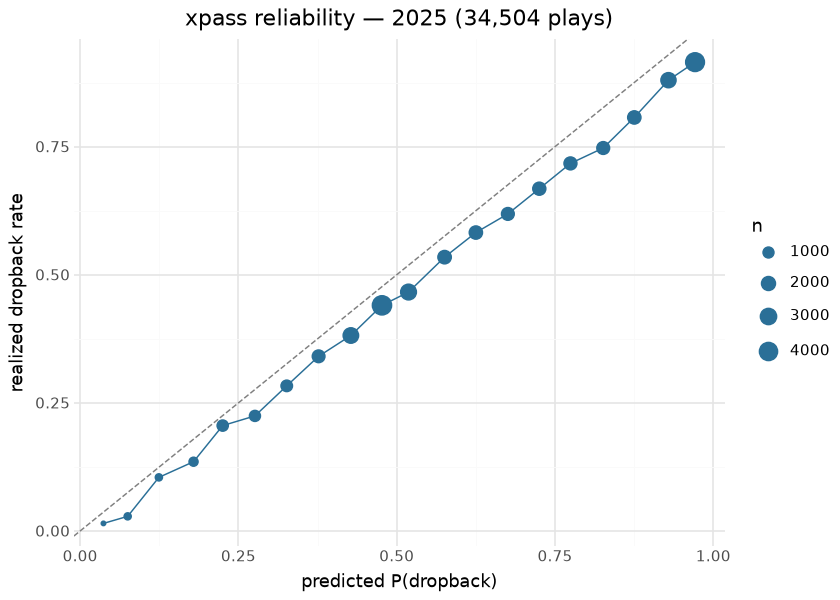

# Expected Pass (`xpass_model`)

The expected-pass model estimates the probability that a scrimmage play
is a **dropback (pass)** given pre-snap game state — a measure of how
*predictable* an offense’s tendency is. It is the nflfastR xpass
surface, where **`pass_oe = 100 · (pass − xpass)`** is the pass-rate
over expected: positive when an offense passes more than
situation-average. A full-history (1999–2025) retrain following the
nflverse dropback recipe.

This document is compiled: the calibration and team-tendency sections
evaluate the published `xpass` / `pass_oe` columns on the latest
`nfl_model_pbp` season at render time.

## Model features

**19 features**, pre-snap; one row per scrimmage play (1999–2025). The
binary label is `pass` (dropback). Note it consumes the [WP
surfaces](wp_spread.md) (`wp`, `vegas_wp`) as features.

| Feature | What it encodes |
|----|----|
| `down`, `ydstogo`, `yardline_100`, `qtr` | Down/distance/field position/quarter — the tendency backbone. |
| `wp`, `vegas_wp` | In-game win probability (game-script urgency). |
| `score_differential`, `half_seconds_remaining` | Score/clock context. |
| `home` | Possession team is home. |
| `posteam_timeouts_remaining`, `defteam_timeouts_remaining` | Timeouts. |
| `era0`..`era4` | Rule-era one-hot (cuts 2001/2005/2013/2017) — era-aware across all of 1999–2025. |
| `outdoors`, `retractable`, `dome` | Stadium-type one-hots. |

## The model

**Algorithm.** XGBoost, `objective=binary:logistic`, **1,121 rounds**,
`eta=0.015`, `gamma=2`, `max_depth=7`, `min_child_weight=0.9`,
`subsample/colsample=0.8`, `base_score=mean(label)`, `seed=2013` —
verbatim from the nflverse dropback-model recipe. The predicted
probability is `xpass`; **`pass_oe = 100 · (pass − xpass)`** is the
actionable residual.

**Evaluation.** Full-history retrain on 892,122 plays.
Parity-vs-nflverse is **informational** (the nflverse oracle trains on
2006+): P(pass) corr **0.989** — see [Parity](parity.md).

## Feature importance

| Top 12 features by gain — bundled xpass booster |       |
|-------------------------------------------------|-------|
| feature                                         | gain  |
| down                                            | 308.5 |
| ydstogo                                         | 210.9 |
| qtr                                             | 88.1  |
| wp                                              | 77.0  |
| half_seconds_remaining                          | 51.6  |
| posteam_timeouts_remaining                      | 26.7  |
| yardline_100                                    | 25.7  |
| score_differential                              | 24.8  |
| defteam_timeouts_remaining                      | 20.4  |
| vegas_wp                                        | 19.5  |
| era4                                            | 17.8  |
| home                                            | 12.3  |

&#10;

## Calibration — render time, published surface

The published season carries `xpass` and `pass_oe` on every scrimmage
play, and the realized dropback indicator is recoverable exactly as
`pass = xpass + pass_oe/100`. Binned reliability of the applied surface:

| Render-time xpass evaluation — 2025 |             |
|-------------------------------------|-------------|
| metric                              | value       |
| plays                               | 34,504.0000 |
| realized dropback rate              | 0.5692      |
| Brier (xpass)                       | 0.1927      |
| baseline Brier (constant rate)      | 0.2452      |

&#10;

## Results — team tendency, 2025

| Most pass-happy and most run-heavy over expectation — 2025 |  |  |  |  |
|----|----|----|----|----|
| pass_oe = percentage points of dropback rate over the situation-expected rate |  |  |  |  |
|  | Offense | Plays | Pass rate | PROE |
|  | LA | 1,261 | 58.8% | 2.37 |
|  | CIN | 1,044 | 64.5% | 1.08 |
|  | ARI | 1,070 | 66.1% | 0.55 |
|  | KC | 1,045 | 60.1% | −0.78 |
|  | DEN | 1,197 | 59.7% | −1.40 |
|  | CAR | 1,054 | 56.0% | −7.90 |
|  | NYG | 1,075 | 53.3% | −8.93 |
|  | WAS | 972 | 51.4% | −10.88 |
|  | BAL | 954 | 48.6% | −12.50 |
|  | NYJ | 1,001 | 55.0% | −13.97 |

&#10;

## Limitations

xpass is **pre-snap**: no personnel, formation, motion, or no-huddle
signal, so it captures the situation-explainable part of tendency only.
Two offenses in identical game state get the same xpass — the *team*
tendency lives in `pass_oe`, not in xpass itself.

## Provenance

| field | value |
|----|----|
| `model_type` | xpass |
| `objective` | binary:logistic |
| `features` | 19 (era0..4 + `wp` / `vegas_wp`) |
| `label` | pass (dropback) |
| `training_seasons` | 1999–2025 (892,122 plays) |
| `hyperparameters` | eta=0.015, max_depth=7, nrounds=1121 |
| `lineage` | nflverse dropback model |
| `parity` | P(pass) corr 0.989 (informational; full-history vs nflverse 2006+) |
| `distribution` | bundled in sportsdataverse |
| `rebuild this doc` | `scripts/render_model_docs.sh` (Quarto → GFM; `uv sync --group docs`) |

## Avenues for improvement & open issues

- **Motion/personnel data** — the known ceiling-lifter absent from
  public pbp.
- **Resolved (2026-09-01, sportsdataverse-py PR \#422):** a season
  beyond `ERA_MAX_KNOWN_SEASON` (the era-aware retrain corpus end) now
  raises `EraCoverageWarning` from every era-building helper instead of
  being absorbed into `era4` silently; the constant is bumped at each
  era-aware retrain, which is where a new dummy would be evaluated.
