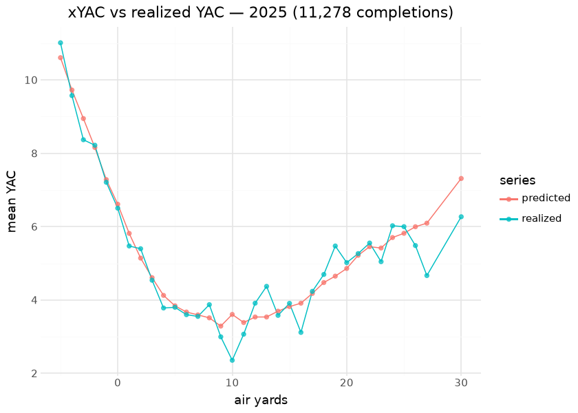

# Expected Yards After Catch (xYAC)

The xYAC model predicts the **distribution of yards gained after the
catch** on a completed pass, given the throw geometry and game state at
the moment of the catch. It is a faithful re-implementation of the
nflfastR `add_xyac` model — a **76-class multinomial** over post-catch
gain — and feeds the expected-YAC surface (`xyac_epa`,
`xyac_mean_yardage`) used to decompose a completion into its air vs
after-catch contributions.

This document is compiled: the evaluation below holds the published
`xyac_mean_yardage` column against **realized** yards after catch on the
latest published season — a live predicted-vs-realized check of the
applied model.

## Model features

**19 features** — the [CP](cpoe.md) feature set plus `distance_to_goal`.
The label is the post-catch yardage bucketed into 76 ordinal classes.
Like CP, xYAC depends on `air_yards` charting (2006+), so only `era2..4`
are carried.

| Feature | Type | What it encodes |
|----|----|----|
| `air_yards` | numeric | Air distance to the catch point — sets where YAC starts. |
| `distance_to_goal` | numeric | Yards from the catch point to the end zone — **caps** achievable YAC near the goal line. |
| `distance_to_sticks` | numeric | `air_yards − ydstogo`. |
| `yardline_100` / `ydstogo` | numeric | Field position and yards to go at the snap. |
| `air_is_zero` / `pass_middle` / `qb_hit` | binary | Screen/behind-LOS, over-the-middle, pressure indicators. |
| `down1` … `down4` | one-hot | Current down. |
| `home` | binary | Possession team is home. |
| `dome` / `retractable` / `outdoors` | binary | Stadium-type one-hots. |
| `era2` … `era4` | one-hot | Rule era from 2006. |

## The model

**Algorithm.** XGBoost, `objective=multi:softprob` over
**`num_class=76`**, `eta=0.025`, `max_depth=4` — the nflfastR `add_xyac`
recipe. The 76-class distribution over post-catch gain is the model
output; expected YAC and `xyac_epa` are recovered by combining the class
distribution with the EP surface at each resulting yard line. Trained on
**222,020 completed passes (2006–2025)**.

**Evaluation.** Faithful port of nflfastR `add_xyac` — the 76-class
multinomial reproduces the nflverse YAC distribution. xYAC is a
**download-on-demand** model in `sportsdataverse` (the ~34 MB artifact
is fetched and cached rather than bundled); the artifact is committed
here at `models/xyac_model.ubj`.

## Feature importance

| Top 12 features by gain — committed xYAC booster |      |
|--------------------------------------------------|------|
| feature                                          | gain |
| air_yards                                        | 27.7 |
| distance_to_goal                                 | 15.9 |
| distance_to_sticks                               | 13.7 |
| pass_middle                                      | 12.3 |
| air_is_zero                                      | 6.2  |
| yardline_100                                     | 4.7  |
| down3                                            | 4.7  |
| ydstogo                                          | 4.6  |
| era4                                             | 4.1  |
| outdoors                                         | 4.0  |
| down1                                            | 3.9  |
| qb_hit                                           | 3.8  |

&#10;

`air_yards` and `distance_to_goal` dominate — air depth sets the YAC
starting point and the goal line caps it — with `air_is_zero` /
`pass_middle` separating screens and crossers (high-YAC archetypes) from
contested downfield throws. (A per-play SHAP pass is deliberately
omitted: multiclass `pred_contribs` on a 76-class head is a 3-D
`(n, 76, 20)` tensor — the recorded gotcha — and the mean-YAC
attribution it would aggregate to is already what the gain table and the
depth curves below show.)

## Calibration — predicted vs realized YAC, render time

| Render-time xYAC evaluation — 2025 season |  |
|----|----|
| per-completion correlation is bounded by irreducible YAC variance; the aggregate bias is the honest calibration number |  |
| check | value |
| completions evaluated | 11,278.000 |
| mean predicted xYAC | 5.443 |
| mean realized YAC | 5.357 |
| mean error (pred − real) | 0.085 |
| corr(pred, real) per completion | 0.375 |

&#10;

The screen-depth region (negative/zero air yards) carries the highest
YAC and the tightest predicted-realized agreement; deep throws carry
little YAC and more relative noise — exactly the structure the 76-class
head is built around.

## Results — YAC over expected, 2025

| YAC over expected — 2025 (min 40 catches) |  |  |  |  |  |  |
|----|----|----|----|----|----|----|
| realized YAC minus the geometry-expected YAC; the broken-tackle/athleticism residual the model is deliberately blind to |  |  |  |  |  |  |
|  | Receiver | Team | Rec | YAC | xYAC | YAC−xYAC |
|  | B.Robinson | ATL | 78 | 857.0 | 580.5 | 276.5 |
|  | C.McCaffrey | SF | 108 | 766.0 | 621.1 | 144.9 |
|  | D.Metcalf | PIT | 57 | 443.0 | 299.1 | 143.9 |
|  | G.Pickens | DAL | 87 | 479.0 | 341.3 | 137.7 |
|  | K.Walker | SEA | 40 | 441.0 | 313.5 | 127.5 |
|  | J.Williams | DET | 64 | 433.0 | 310.1 | 122.9 |
|  | C.Parkinson | LA | 48 | 368.0 | 247.7 | 120.3 |
|  | R.Stevenson | NE | 43 | 403.0 | 289.0 | 114.0 |
|  | J.Warren | PIT | 41 | 439.0 | 338.9 | 100.1 |
|  | R.Rice | KC | 51 | 414.0 | 318.2 | 95.8 |

&#10;

## Limitations

xYAC is blind to the broken-tackle / open-field athleticism that drives
the YAC tail, so it captures the *situation-and-geometry-explainable*
mean, not a specific receiver’s elusiveness — which is precisely what
makes YAC-over-expected a meaningful receiver skill residual. The
76-class window clips extreme returns. Because it depends on
`air_yards`, it is a 2006+ surface.

## Provenance

| field | value |
|----|----|
| `model_type` | xyac |
| `objective` | multi:softprob (num_class=76) |
| `features` | 19 (CP set + `distance_to_goal`) |
| `label` | post-catch yardage (76 ordinal classes) |
| `training_seasons` | 2006–2025 |
| `n_training_rows` | 222,020 |
| `hyperparameters` | eta=0.025, max_depth=4 |
| `lineage` | nflfastR `add_xyac` |
| `artifact` | `models/xyac_model.ubj` (committed; download-on-demand in sportsdataverse) |
| `rebuild this doc` | `scripts/render_model_docs.sh` (Quarto → GFM; `uv sync --group docs`) |

## Avenues for improvement & open issues

- **Continuous target** — the 76-class distribution could be compared
  against a monotone continuous head; distributional calibration beyond
  the mean is unevaluated (the render-time check above evaluates the
  mean only).
- **Known issue:** `distance_to_sticks` sign conventions bit once
  already (recorded gotcha) — any feature change must re-verify it.
